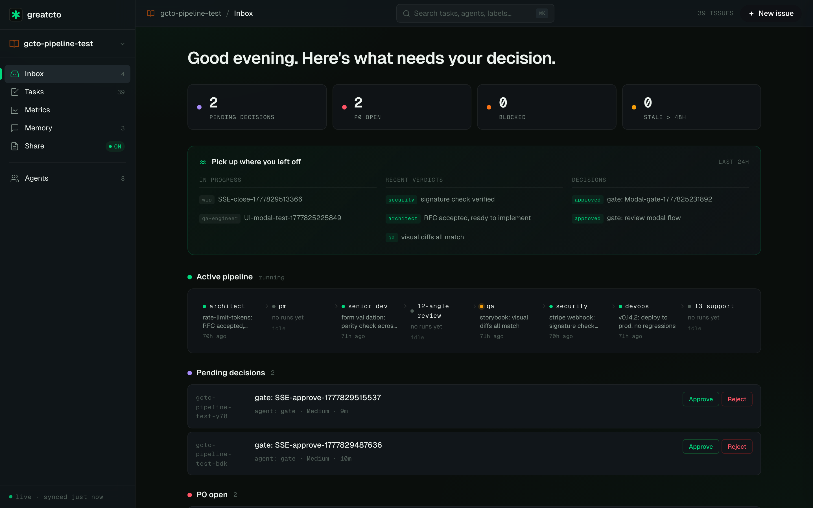
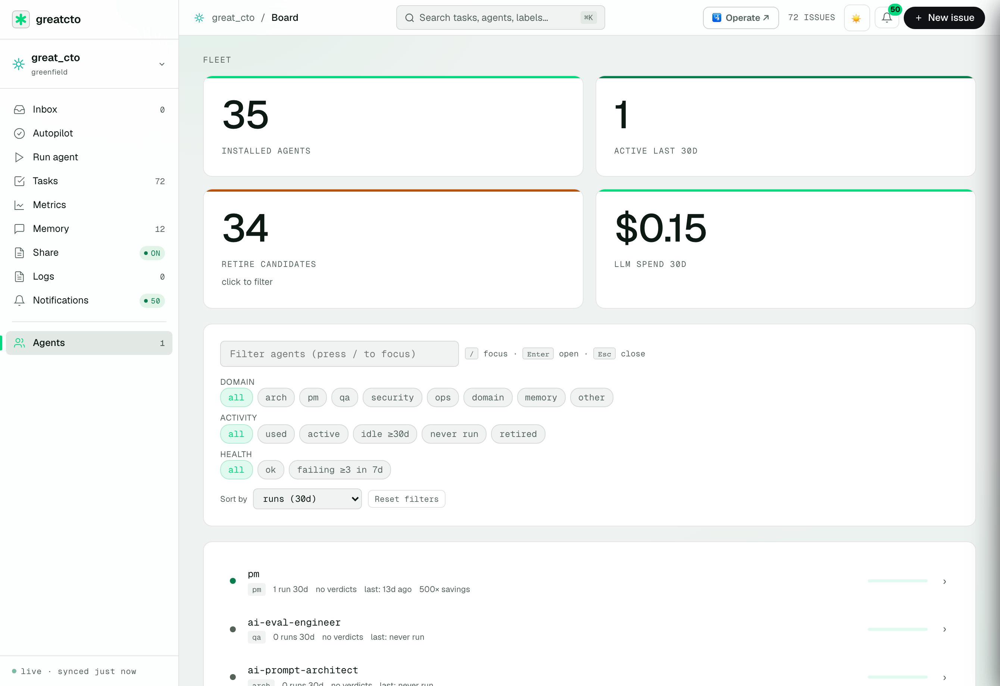

<div align="center">


**Solo-CTO mode. Stop being the only person who can ship.**

**The engineering OS for Claude Code** — open-source, local-first alternative to Devin. great_cto orchestrates **57 specialist agents** around your Claude Code: architect, PM, senior-dev, code-reviewer, qa-engineer, security-officer, devops, plus 30 archetype reviewers (including gdpr-reviewer, us-privacy-reviewer, dpdpa-reviewer) and **16 domain packs** (voice-AI · clinical · HR-AI · API platform · lending · clinical trials · robotics · EM-fintech · climate · drug-discovery · digital-health · edtech · gov · gaming · enterprise · insurance).

You're the solo CTO. You're also the bottleneck. **GreatCTO is 50 specialist agents** that handle architecture, review, QA, security, and deploy — while you make **two decisions per feature**.

**Built for the one-person engineering org.** Indie hackers, solo founders, and technical CTOs running everything themselves. *Not built for teams* — see [FAQ](docs/FAQ.md#is-great_cto-for-teams).

[](https://www.npmjs.com/package/great-cto)
[](https://www.npmjs.com/package/great-cto)
[](LICENSE)
[](https://claude.com/plugins)

[Website](https://greatcto.systems) · [📐 Architecture](https://greatcto.systems/architecture) · [📜 One real run](https://greatcto.systems/proof) · [📊 MTTR methodology](docs/benchmarks/MTTR.md) · [Live demo](https://greatcto.systems/r/CsqYVXs1Vibac5yp) · [Discussions](https://github.com/avelikiy/great_cto/discussions) · [Changelog](CHANGELOG.md)

[Русский](docs/ru/README.md) · [简体中文](docs/zh-CN/README.md) · [繁體中文](docs/zh-TW/README.md) · [日本語](docs/ja/README.md) · [한국어](docs/ko/README.md) · [Español](docs/es/README.md) · [Português](docs/pt-BR/README.md) · [Deutsch](docs/de/README.md) · [Français](docs/fr/README.md)

</div>

## What is great_cto?

You describe what you want (`/start "build a billing endpoint"`). 57 specialist agents — architect, PM, senior-dev, code-reviewer, qa-engineer, security-officer, devops, l3-support, plus 30 archetype reviewers and **16 domain packs** (voice-AI · clinical · HR-AI · API platform · lending · clinical trials · robotics · EM-fintech · climate · drug-discovery · **digital-health · edtech · gov · gaming · enterprise · insurance**) — orchestrate the SDLC: archetype detection → pack overlay → architecture + ADRs → threat model → plan + Beads tasks → TDD impl → 12-angle review → QA → security gate → deploy.

The pipeline scales to the work: a 1-line typo fix runs through 1 agent in 30s; a deep cross-cutting feature runs through 7+ agents over an hour. **You confirm two gates** (plan, ship). Everything else is automatic.

## Two decisions per feature

```
🟡 gate:plan   ←  you decide here (architecture + tasks + cost)
   ↓
🤖 senior-dev → 12-angle review → qa-engineer → security-officer → devops
   ↓
🟢 gate:ship   ←  you decide here (PR ready, security signed off)
```

Architects, planners, reviewers, QA, security, DevOps run automatically between those two human checkpoints. **Memory persists** between sessions: every gate verdict appends to `~/.great_cto/decisions.md`, every retrospective appends to per-project `lessons.md`, and `/crystallize` promotes high-impact patterns to a global library agents query before re-solving.

## Critics before the plan

The most expensive bugs aren't in the code — they're in decisions made before coding starts. Three critic agents run before the Plan stage, at the three positions where a mistake costs the most:

| Critic | Catches |
|---|---|
| **Architecture critic** | Coupling that rules out multi-tenancy later · "obvious" O(n²) on real-scale data · circular dependencies between bounded contexts |
| **Spec critic** | "We solved the wrong problem" — the worst class of bug, because no unit test will catch it · misaligned acceptance criteria · scope that was never agreed on |
| **Schema critic** | `NOT NULL` without a default on a 50M-row table (deadlock in 10min after deploy) · missing `CONCURRENTLY` on index creation · irreversible migrations with no rollback path |

Previously critics only activated starting from Plan. Now the pipeline catches architectural and spec-level mistakes before implementation begins — when reverting costs hours, not days.

## How great_cto compares

|  | **great_cto** | Devin | Claude Code (alone) |
|---|---|---|---|
| Open source | ✅ MIT | ❌ closed | ❌ closed plugin model |
| Self-host | ✅ runs locally | ❌ Cognition cloud | ✅ |
| BYOK / multi-model | ✅ Claude Code | ❌ proprietary | ❌ Anthropic only |
| Specialist agents | **57** (architect · PM · 12-angle review · QA · security · devops · 30 archetype reviewers · 16 domain packs) | 1 generalist | 1 generalist |
| SDLC orchestration | architect → plan → impl → review → QA → security → devops | one-shot autonomy | edit loop |
| Human gates | ✅ 2 per feature (plan + ship) | ❌ none | ❌ |
| Memory across sessions | ✅ `decisions.md` + `lessons.md` + crystallize | ⚠️ thread only | ⚠️ thread only |
| Cost tracking | ✅ per-agent + 30d history + savings_x | ❌ | ❌ |
| Compliance frameworks | ✅ 33+ (PCI · HIPAA · SOX · GDPR · CCPA · DPDPA · EU AI Act · FDA SaMD · COPPA · FERPA · FedRAMP · NAIC · …) | ❌ | ❌ |
| Pricing | free (you pay your LLM provider) | $500/mo | $20/mo |
| Setup | `npx great-cto init` | sign up | install CLI |

great_cto is **not** another coding-agent loop — it's the **orchestration layer above** the coding agent you already use. Think "specialist team that reviews and gates the work" rather than "another assistant that types code."

## Quick install

```bash
npx great-cto init
```

The CLI scans your repo, picks the right archetype, wires compliance gates automatically. Works on new or existing projects. Restart Claude Code afterwards.

**Requires:** [Claude Code](https://claude.com/claude-code) · Node 18.17+

Superpowers and Beads companion plugins install automatically — no manual setup needed.

## Jurisdiction detection

`npx great-cto init` scans your project for geo and legal signals — domain TLDs, locale configs, README keywords, legal folder names — and auto-detects which jurisdictions apply:

| Jurisdiction | Triggered by | Compliance agents loaded |
|---|---|---|
| EU | `.eu` TLD, `gdpr`, `dsgvo`, locale `de/fr/pl/…` | `gdpr-reviewer` |
| US-CA | `ccpa`, `california`, `.ca.gov` | `us-privacy-reviewer` |
| UK | `.co.uk`, `ico`, `uk-gdpr` | `gdpr-reviewer` |
| IN | `.in` TLD, `dpdpa`, `pdp bill` | `dpdpa-reviewer` |
| BR | `.com.br`, `lgpd` | `gdpr-reviewer` (closest equivalent) |
| AU, SG | `.com.au`, `.sg`, `pdpa` | `us-privacy-reviewer` |

Detected jurisdiction is written to `PROJECT.md` as `jurisdiction: [EU, US-CA]` and gates the appropriate reviewer on every feature.

## The board you'll actually check

`great-cto board` opens an admin UI at `http://localhost:3141` — Kanban with realtime SSE updates, per-agent cost tile, pipeline status across 8 stages, and a 30-day cost history that pairs LLM spend with the human-equivalent baseline.

<p align="center">
  
</p>

<table>
<tr>
<td width="50%"><a href="docs/screenshots/metrics.png"></a><br/><sub><b>Metrics</b> — LLM cost, human-equivalent baseline, savings_x ratio</sub></td>
<td width="50%"><a href="docs/screenshots/inbox.png"></a><br/><sub><b>Inbox</b> — pending gates, P0 incidents, blocked tasks, stale in-progress</sub></td>
</tr>
<tr>
<td width="50%"><a href="docs/screenshots/agents.png"></a><br/><sub><b>Agents</b> — 57 specialists with last-used + run counts</sub></td>
<td width="50%"><a href="docs/screenshots/memory.png"></a><br/><sub><b>Memory</b> — 11 layers + crystallized incident patterns</sub></td>
</tr>
</table>

| Tile | What you see |
|---|---|
| Tasks | Backlog → in-progress → done, drag to update via `/api/tasks/<id>/status` |
| Cost (30d) | LLM $ vs human-equivalent $; flag if `savings_x < 100×` |
| Agent fleet | 57 agents with last-used + per-agent run count |
| Inbox | Pending gates, P0 incidents, blocked tasks (auto-sorted) |
| Pipeline | 8-stage SDLC with status (architect → pm → senior-dev → … → devops) |

Full API surface: [docs/BOARD-API.md](docs/BOARD-API.md).

## Three commands you use every day

```bash
/start "build a refund endpoint with PCI-DSS scoping"
# → architect → enterprise-saas-reviewer (PCI-DSS auto-loaded)
# → pm → 5 Beads tasks → gate:plan (you approve)
# → senior-dev → 12-angle review → qa → security-officer
# → gate:ship (you approve) → devops → deployed

/inbox
# Pending gates · P0 incidents · blocked tasks · stale in-progress

/digest
# Weekly DORA + delta vs last week + cost-per-feature roll-up
```

Plus: `/audit` (existing-codebase scan), `/cost` (LLM router savings), `/sec` (security umbrella), `/oncall`, `/release`, `/rfc`. Full list: `~/.claude/commands/` after install.

## Cost

```
~$34/month for a typical solo-CTO project — 20 pipeline runs/month, indicative.
```

| Pipeline | Cost/run | Runs/mo | Total |
|---|---|---|---|
| quick (config / typo) | $0.10 | 10 | $1 |
| quick (new endpoint) | $1 | 6 | $6 |
| standard (feature) | $5 | 3 | $15 |
| deep (cross-cutting) | $12 | 1 | $12 |
| | | | **~$34** |

Pay your own Anthropic API tokens. **No per-seat fee. No SaaS lock-in.** Routine triage auto-routes to Kimi K2 (Sonnet-equivalent at ~5× lower cost) → 60–80% reduction on log clustering.

## 25 archetypes auto-detected

Each archetype activates its own specialist agents and compliance checklists. Top 7:

| Archetype | Tier | Specialist agents | Compliance |
|---|---|---|---|
| `enterprise-saas` | **deep** | enterprise-saas-reviewer | soc2-type-2 · iso27001 · gdpr · ccpa |
| `agent-product` | **deep** | ai-prompt-architect · ai-eval · ai-security | eu-ai-act · owasp-llm-top-10 |
| `fintech` | **deep** | pci · regulated | pci-dss · sox · kyc-aml · gdpr · dora |
| `mlops` | **deep** | mlops-reviewer · ai-eval | eu-ai-act · nist-ai-rmf · iso42001 |
| `library` | baseline | library-reviewer | openssf · sbom |
| `cli-tool` | baseline | cli-reviewer | — |
| `mobile-app` | standard | mobile-store-reviewer | store-policy · gdpr |

Full table (25 archetypes) + how detection works: [docs/ARCHETYPES.md](docs/ARCHETYPES.md).

## 16 domain packs — overlay reviewers

Domain packs ride **on top of** archetypes. Auto-attached when CLI detects pack-specific signals (deps, README terms). Each pack adds its own reviewer(s), threat-model template, EVAL suite, and human gates — independent of base archetype.

| Category | Packs |
|---|---|
| **AI verticals** | `voice-pack` · `clinical-pack` · `hr-ai-pack` · `drug-discovery-pack` |
| **Digital health** | `digital-health-pack` _(wearable telemetry · mental-health AI · nutrition AI · physician HITL)_ |
| **Fintech / regulated** | `lending-pack` · `em-fintech-pack` · `insurance-pack` · `enterprise-pack` |
| **High-compliance** | `clinical-trials-pack` · `gov-pack` · `edtech-pack` · `climate-pack` |
| **Engineering** | `api-platform-pack` · `robotics-pack` · `game-pack` |

→ **27 human-gate types** + 50+ reference EVAL suites + 20 TM templates. Browse all 16 packs with **4-layer journey visualization** (archetype → pack → reviewer → gate): [greatcto.systems/packs.html](https://greatcto.systems/packs.html).

### Jurisdiction Detection

GreatCTO auto-detects applicable compliance frameworks from project geography signals:

| Jurisdiction | Signals | Frameworks | Reviewer |
|---|---|---|---|
| `eu` | gdpr · eu users · nis2 · eu ai act | GDPR · EU AI Act · NIS2 | `gdpr-reviewer` |
| `us-ca` | ccpa · cpra · do not sell | CCPA / CPRA | `us-privacy-reviewer` |
| `uk` | uk gdpr · information commissioner · dpa 2018 | UK GDPR · DPA 2018 | `gdpr-reviewer` |
| `in` | dpdpa · india users · rbi data localisation | DPDPA 2023 · RBI | `dpdpa-reviewer` |
| `br` | lgpd · anpd · brazil users | LGPD | `gdpr-reviewer` |
| `au` | privacy act 1988 · oaic | Privacy Act 1988 · CDR | `us-privacy-reviewer` |
| `sg` | pdpa · pdpc · mas guidelines | PDPA · MAS TRM | `us-privacy-reviewer` |

Set or override in `.great_cto/PROJECT.md`:
```yaml
jurisdiction: [eu, us-ca]
```

## One real run, fully traced

A Python CLI feature shipped through the full pipeline: **$2.39 LLM spend** vs ~$5,460 human-equivalent. Security caught two real defects QA had passed (`list(stream_csv())` defeated streaming → 14.5 MB peak RSS on 13 MB input). Multi-reviewer model catching what single agents miss, before merge.

Full trace + artefacts: [greatcto.systems/proof](https://greatcto.systems/proof) · raw: [`docs/qa/runs/2026-05-09/E2E-CLI-PIPELINE.md`](docs/qa/runs/2026-05-09/E2E-CLI-PIPELINE.md).

## CI integration

Drop into any GitHub Actions workflow:

```yaml
- run: npx great-cto@latest ci ./ --sarif results.sarif
- uses: github/codeql-action/upload-sarif@v3
  if: always()
  with: { sarif_file: results.sarif }
```

`great-cto ci` auto-detects `$GITHUB_ACTIONS` and emits `::error file=...,line=N::` annotations inline on PR diffs. Exit codes: 0 clean / 1 findings / 2 setup error.

## Test pyramid

Layered test suite — **structural + state-machine tier runs in <2 min for $0** (`node --test tests/*.test.mjs`); real-LLM tier (25 archetypes × 4-8 stages + 15 packs + 9 reviewers) runs on-demand via OpenRouter for ~$5–10. Full breakdown: [docs/testing/](docs/testing/).

## MCP

Native [MCP](https://modelcontextprotocol.io/) server — call great_cto's tools (`scan`, `list_rules`, `detect_archetype`, `estimate_cost`, `query_decisions`) from Claude Desktop or any MCP host:

```json
{ "mcpServers": { "great-cto": { "command": "npx", "args": ["-y", "great-cto@latest", "mcp"] } } }
```

Full setup + internal MCPs (Grafana, LLM router, Beads): [docs/MCP.md](docs/MCP.md).

## Email alerts (zero-setup)

Five things that need you to act in <2h get emailed automatically — even when you're away from the board:

| Trigger | When |
|---|---|
| 🚨 **P0 incident** | A P0 task opens in any project |
| ⏸️ **Gate stale > 2h** | A `gate:ship` is waiting on you for hours |
| 🛡️ **Security BLOCKED** | `security-officer` rejected a merge |
| 💸 **Budget alert** | Monthly LLM spend crosses 80% / 100% of budget |
| 📊 **Weekly digest** | Friday 09:00 — shipped, spent, savings, QA |

**Setup**: board → **Notifications** tab → enter email → enter the 6-digit code we send → pick triggers. No Resend signup, no API keys — delivery routed through `greatcto.systems/notify` (free, 100 emails/24h per verified email).

## Limitations & non-goals

- **Not for teams** — solo-CTO is the product. 2+ engineers? You've outgrown it.
- **Not a replacement for senior engineers** — codifies process; doesn't make architectural judgement calls without one.
- **Not a CI/CD system** — gates run locally / in-session. You still need GitHub Actions for actual merge.
- **Not certification-audited** — PCI/HIPAA/SOC2 archetype scaffolds are starting points, not certifications.
- **Not deterministic** — LLM-generated outputs. Every gate verdict should be sanity-checked.

## FAQ (top 5)

**Is my source code used to train models?** No. Claude API zero-retention by default for paying customers. great_cto adds nothing.

**How do you keep token costs down?** Haiku-by-default + Kimi K2 router for triage (60–80% savings) + cost-guard hook.

**Can I disable hooks?** Every hook honors `GREAT_CTO_DISABLE_<NAME>=1`. Per-file opt-out: `// agentshield:ignore`.

**What if I'm not solo?** great_cto is built for the one-person engineering org. If you have 2+ engineers and need shared boards / multi-seat auth, you've outgrown it.

Full FAQ: [docs/FAQ.md](docs/FAQ.md).

## Architecture

The plugin runs inside Claude Code (or any MCP-capable host); 50 agents are markdown specs; tasks live in Beads (dolt, git-native); memory is plain markdown (no vector store). Diagram + stack table: [docs/ARCHITECTURE.md](docs/ARCHITECTURE.md).

## What's new

**v2.17.0** (May 2026) — **companion plugins auto-install** (Superpowers + Beads install automatically on `npx great-cto install` — no more manual setup) · **Architecture / Spec / Schema critics** before the Plan stage — catch the three most expensive mistake types before implementation begins · **llm-leash board: 16 new features** (Cmd-K command palette · Issues subtab · Session timeline · Topology graph · HITL diff · OPA config · SOC2 export · Rule comparison) · **8-jurisdiction detection** auto-activates the right regulatory reviewer (EU · US-CA · UK · IN · BR · AU · SG · CA).

**v2.9.1** — **zero-setup email alerts** (5 trigger types · weekly digest · no Resend signup) · **session-start auto-attach reviewers**.

**v2.8.6** — **16 domain packs** (edtech · gov · gaming · enterprise · insurance) · 4-layer journey visualization.

[Full changelog →](CHANGELOG.md)

## Roadmap

- **Evals runner in CI** — run golden-set eval suites on every PR, catch prompt regressions automatically
- **Self-improving loop** — agents that learn from verdicts and improve their own prompts over time
- **Decision scoring** — track which gate decisions turned out to be right; surface patterns
- **/crystallize** — promote high-impact lessons to reusable skills the whole pipeline can query

[Vote on the next feature →](https://github.com/avelikiy/great_cto/discussions/categories/ideas)

## Author

[avelikiy](https://github.com/avelikiy) — CTO building AI-native trading and fintech platforms (0→1, 1→N). great_cto is the result of automating my own loops, one agent at a time. Every rule appeared in response to a real problem in a real production system.

## Community

| Channel | What |
|---|---|
| 🐛 [Issues](https://github.com/avelikiy/great_cto/issues) | Bugs, feature requests, archetype proposals |
| 💡 [Discussions](https://github.com/avelikiy/great_cto/discussions) | Questions, patterns, show-and-tell |
| 📝 [Blog](https://velikiy.hashnode.dev) | Architecture deep-dives |
| 🔒 [SECURITY.md](SECURITY.md) | Responsible disclosure |

## Contributing & License

Pull requests welcome — see [CONTRIBUTING.md](CONTRIBUTING.md). Good first issues: [`good-first-issue`](https://github.com/avelikiy/great_cto/issues?q=is%3Aopen+label%3Agood-first-issue).

MIT — see [LICENSE](LICENSE).

If great_cto saved you time, please star the repo — it helps other solo CTOs find it.

[](https://star-history.com/#avelikiy/great_cto&Date)

---

<div align="center">

**Built by [@avelikiy](https://github.com/avelikiy)**
*Stop being the only person who can ship.*

</div>
