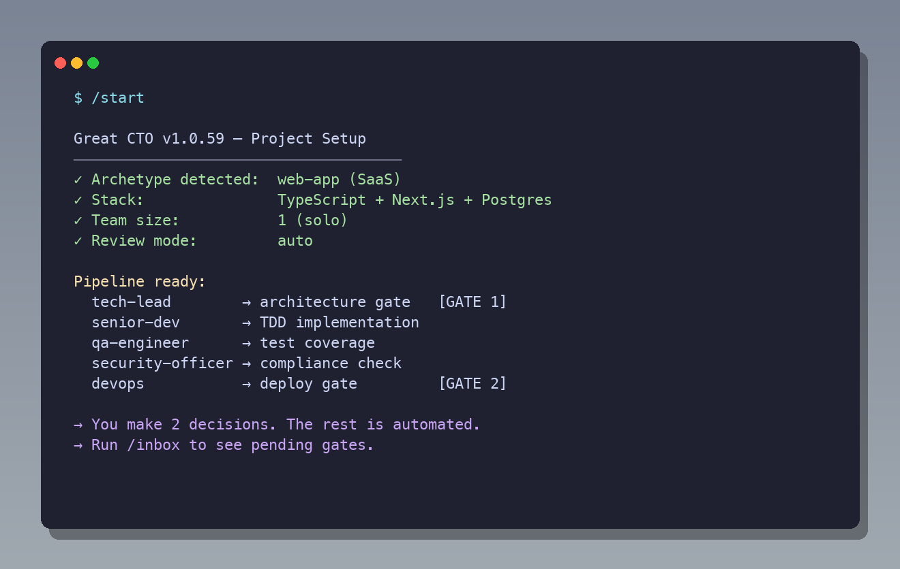
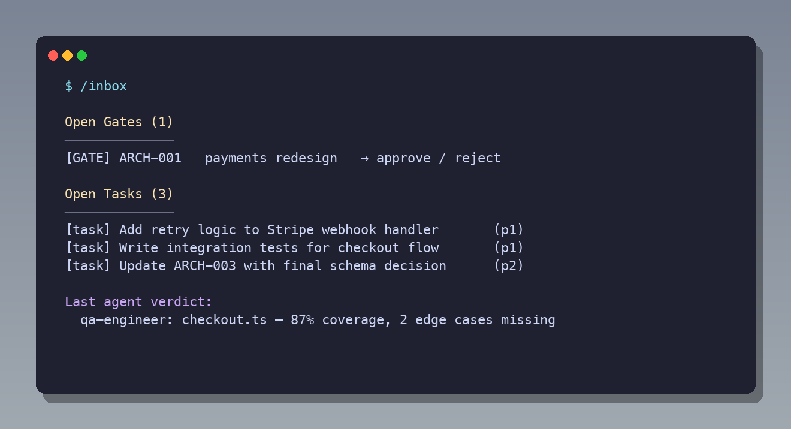

# great_cto

> The engineering process for solo founders and teams up to 50 engineers — without the overhead.

[](https://github.com/avelikiy/great_cto/stargazers)
[]()
[](https://www.npmjs.com/package/great-cto)
[](https://github.com/avelikiy/great_cto/actions/workflows/cli-ci.yml)
[](https://nodejs.org)
[]()
[](https://claude.com/plugins)

---

You don't have a CTO. Or you are the CTO — and you're the bottleneck.

Every feature gets stuck behind the same questions: *Is the architecture right? Did we miss a security issue? Will this break in production?* You either skip those questions (and pay for it later) or you become the person blocking everything.

**great_cto is the third option.** Plug it into Claude Code. Describe what you're building. Seven agents handle architecture, implementation, code review, QA, security, and deployment. You make two decisions per feature. That's it.



---

## What two decisions look like

```
You:  /start "add Stripe subscriptions to our SaaS — monthly and annual plans"

great_cto:
  → archetype: commerce  |  size: medium  |  5 agents  [~45min]
  → compliance: [pci-dss, owasp]  |  security gate: mandatory
  → weekly: digest Mon 9:00 + audit Sun 23:00 scheduled

  tech-lead:   ARCH-stripe-subscriptions.md
               Cost estimate: medium ~$4-6 | 45min | +20% security surcharge
               gate:arch ← DECISION 1

You: "approved"

  senior-dev:  TDD implementation  |  91% coverage
  /review ×12: P0:0  P1:1  P2:3  —  webhook signature missing → fixed
  qa-engineer: PASS  |  REQ-001 ✓  REQ-002 ✓  REQ-003 ✓
  security:    APPROVED  |  PCI-DSS ✓  |  0 CVEs
               gate:ship ← DECISION 2

You: "ship it"

  devops:   staging OK → canary 5% → 20% → 100%  |  error rate: 0.02%
  l3-support: 30min watch: OK. RELEASE-2026-04-16.md written.
```

Two approvals. One feature. Done.

---

## The math

Hiring the engineering process you skip:

| Role | Salary | Fully loaded |
|------|--------|-------------|
| Tech Lead (architecture, ADRs) | $200K | $270K |
| Senior Engineer (TDD implementation) | $180K | $245K |
| QA Engineer (test coverage, traceability) | $120K | $165K |
| Security Engineer (audit, compliance) | $150K | $205K |
| DevOps (deploy, canary, incidents) | $130K | $180K |
| **Team total** | **$780K** | **~$1.07M/year** |

great_cto on a typical product team (20 pipeline runs/month):

| Pipeline | Cost/run | Runs | Monthly |
|----------|----------|------|---------|
| nano — config fix, typo | ~$0.10 | 10 | ~$1 |
| small — new endpoint | ~$1 | 6 | ~$6 |
| medium — standard feature | ~$5 | 3 | ~$15 |
| large — cross-cutting change | ~$12 | 1 | ~$12 |
| **Total** | | | **~$34/month** |

**~$400/year vs ~$1.07M/year.**

What you still need: a human engineer to write code and make decisions. great_cto handles the process that wraps that code — architecture design, code review, QA, security audit, deployment. You make two calls per feature. The agents do the rest.

---

## Install — stack-aware bootstrap

```bash
npx great-cto init
```

The CLI reads your repo, picks the right archetype, and wires compliance gates for you. Sample output on a Stripe + Next.js project:


```
[1/5] scanning ./
  stack: next.js, nodejs, stripe, supabase, typescript
  tests: yes  CI: no
[2/5] picking archetype
  archetype: commerce (confidence: high)
  rationale: payments SDK detected: Stripe — PCI-DSS gate mandatory
  suggested compliance: gdpr, pci-dss
[3/5] installing plugin into ~/.claude/plugins/cache/local/great_cto/1.0.61/
[4/5] enabling great_cto@local in ~/.claude/settings.json  (backup taken)
[5/5] created .great_cto/PROJECT.md (archetype: commerce)

✓ great_cto is ready.
```

**Why the CLI, not a manual clone?** It auto-picks from 11 archetypes and 13 compliance frameworks based on your actual dependencies — so you don't spend 30 minutes reading docs to figure out whether your FastAPI + PyTorch service needs an EU AI Act gate (yes), or whether your Stripe app needs PCI-DSS (yes). It also does atomic `settings.json` merge with timestamped backup and never overwrites an existing `PROJECT.md`.

**Safety-first:**
- **Zero runtime dependencies** — pure Node, readable source at [`packages/cli/src/`](packages/cli/src/)
- **47 tests** covering stack detection, archetype scoring, and `settings.json` merge ([`packages/cli/tests/`](packages/cli/tests/))
- **CI matrix**: Node 18/20/22 × Ubuntu/macOS/Windows ([`.github/workflows/cli-ci.yml`](.github/workflows/cli-ci.yml))
- **`--dry-run`** available to preview every change before it touches your `~/.claude/`

What it does under the hood:

1. **Scan** — `package.json`, `requirements.txt`, `Cargo.toml`, `go.mod`, `*.tf`, `*.sol`, `Chart.yaml` (50+ signals)
2. **Pick** archetype — web-service · commerce · ai-system · web3 · infra · data-platform · mobile-app · library · iot-embedded · regulated · greenfield
3. **Install** plugin into `~/.claude/plugins/cache/local/great_cto/<latest>/`
4. **Merge** `~/.claude/settings.json` atomically (validates JSON, writes `.bak-<timestamp>`, preserves other keys)
5. **Bootstrap** `.great_cto/PROJECT.md` with detected archetype, stack, and suggested compliance

Restart Claude Code, then:

```bash
/inbox      # what needs attention
/audit      # existing repo — gap analysis + task backlog
/start "…"  # new feature — full SDLC pipeline
```

<details>
<summary><b>Manual install (advanced)</b></summary>

```bash
git clone https://github.com/avelikiy/great_cto.git \
  ~/.claude/plugins/cache/local/great_cto/1.0.61
# Add to ~/.claude/settings.json:
{ "enabledPlugins": { "great_cto@local": true } }
```
</details>

**Requires:** [Claude Code](https://claude.com/claude-code) · Node 18.17+ (for `npx great-cto init`) · [Superpowers](https://github.com/obra/superpowers) · [Beads](https://github.com/steveyegge/beads)

---

## The pipeline

Seven agents. Each one reads `archetype:` + params from PROJECT.md. No type-specific conditionals.

```
tech-lead → senior-dev → [/review ×12] → qa-engineer → security-officer → devops → l3-support
```

| Agent | Model | Advisor | Role |
|-------|-------|---------|------|
| tech-lead | Opus 4.7 | — | Architecture + ADRs + cost estimate. Brain-first lookup. |
| senior-dev | Sonnet 4.6 | Opus (max 1) | TDD implementation. Reads CODEBASE.md + brain.md. |
| qa-engineer | Haiku 4.5 | Sonnet (max 2) | QA report. Requirements traceability. |
| security-officer | Sonnet 4.6 | Opus (max 2) | CSO report. 13 compliance checklists. |
| devops | Haiku 4.5 | Sonnet (max 1) | Deploy. Canary. RELEASE doc. |
| l3-support | Sonnet 4.6 | — | P0 triage. Postmortem. On-call. |
| project-auditor | Sonnet 4.6 | — | Stack detection. Gap analysis. |

Pipeline scales to the work:

| Size | Agents | Gates | Time | When |
|------|--------|-------|------|------|
| `nano` | 1 | 0 | ~5 min | Config fix, typo, one-liner |
| `small` | 3 | 1 | ~20 min | New endpoint, minor feature |
| `medium` | 5 | 2 | ~45 min | Standard feature, new service |
| `large` | 7 | 3 | ~90 min | Cross-cutting, architecture change |
| `enterprise` | 7+ | 4 | ~2-3 h | Regulated, mission-critical |

---

## 12-angle code review


Every `/review` runs 12 independent angles. Not one giant prompt — 12 focused reviewers.

```
1  Performance       — N+1 queries, unbounded loops, missing cache
2  Security          — injection, auth bypass, IDOR, XSS, SSRF
3  Readability       — naming, complexity, missing error handling
4  SQL Safety        — raw interpolation, missing transactions, unbounded results
5  LLM Trust         — prompt injection, output sanitization (ai-system only)
6  Side Effects      — mutations in conditionals, duplicate events, missing cleanup
7  Data Privacy      — PII in logs, over-collection, GDPR/HIPAA violations
8  Error Handling    — swallowed exceptions, missing timeouts, silent failures
9  Concurrency       — race conditions, deadlocks, cache stampede
10 Dependency Freshness — CVEs, abandoned packages, pinned old versions
11 API Contracts     — breaking changes, removed fields, status code drift
12 Design System     — hardcoded colors/spacing, a11y violations (mobile/web only)
```

Each finding rated P0 / P1 / P2. P0 = blocks gate. `/review` uses advisor Opus 4.7 (max 2) for concurrency and LLM trust edge cases.

---

## 10 archetypes. Works on any project.

| Archetype | Covers | Security gate |
|-----------|--------|--------------|
| `web-service` | REST API, GraphQL, gRPC, SSR, SPA, full-stack | conditional |
| `mobile-app` | iOS, Android, Electron, browser extensions | conditional |
| `ai-system` | Agents, RAG, MCP servers, LLM ops, ML, voice | **mandatory** |
| `data-platform` | Pipelines, warehouses, feature stores, analytics | conditional |
| `infra` | IaC, K8s, platform eng, DB migrations, edge | conditional |
| `library` | SDKs, CLIs, compilers, plugins, games | no |
| `commerce` | E-commerce, payments, SaaS, auth services | **mandatory** |
| `web3` | Smart contracts, DeFi, custody, trading bots | **mandatory** |
| `iot-embedded` | IoT devices, hardware drivers | **mandatory** |
| `regulated` | GxP, financial services, ISO 27001, automotive | **mandatory** |

`/start` detects archetype automatically. Override in PROJECT.md at any time.

**Domain packs** add depth for specialized archetypes:
- `ai-pack` — EU AI Act, TCPA, hallucination / WER / TTFB QA extras
- `web3-pack` — FATF, KYC/AML, formal verification, kill-switch QA
- `enterprise-pack` — SOX, DORA, NIS2, ISO 27001, 21 CFR Part 11, TISAX
- `data-pack` — data lineage, point-in-time recovery, retention / residency

Packs auto-load by archetype. Override: `packs: [ai-pack, enterprise-pack]` in PROJECT.md.

---

## 5 commands you use every day




| Command | What it does |
|---------|-------------|
| `/start "description"` | Detects type → archetype → size → writes PROJECT.md → schedules weekly automation |
| `/audit` | Existing repo: stack detection, gap analysis, creates Beads tasks |
| `/inbox` | Open gates, blocked tasks, recent activity. Everything that needs your decision. |
| `/review` | 12-angle code review. Creates or closes `gate:code`. |
| `/rfc new\|list\|close` | Cross-team decisions (guard: team-size < 10 → warns). Accepted RFCs auto-create ADRs. |

Plus situational commands:

| Command | When |
|---------|------|
| `/digest [days] [board]` | Weekly DORA metrics. Add `board` for quarterly CEO/investor report. |
| `/release notes\|changelog\|docs\|sync` | App Store notes, user changelog, stale docs, version sync. |
| `/ownership map\|show\|set\|verify` | Service ownership matrix. Generates CODEOWNERS. |
| `/oncall who\|schedule\|handoff\|escalate` | On-call rotations and shift handoffs. |

---

## The brain — agents that get smarter over time

Every project builds a compiled knowledge base in `.great_cto/brain.md`.

```
/start                →  brain.md initialized (empty synthesis)
tech-lead runs        →  reads brain first, appends to Evidence Timeline after ARCH
/digest runs          →  Dream Cycle: synthesizes signals → updates Current Synthesis
next session starts   →  SessionStart injects brain.md into every agent
```

Six months in: tech-lead knows your architectural patterns, what has failed before, your team's recurring issues. It stops re-inventing decisions that were already made.

**Existing repos** get a zero-dependency codebase map (`.great_cto/CODEBASE.md`): god nodes (most-imported modules = highest coupling), entry points, public API surface, routes, data models. Generated with pure bash — no pip, no npm, no setup. ~30x token reduction for codebase orientation.

---

## Fully automatic (no commands needed)

| Trigger | What happens |
|---------|-------------|
| Session starts | PROJECT.md + brain.md + CODEBASE.md + HANDOFF.md loaded automatically |
| Context compaction | HANDOFF.md written — next session resumes from exact pipeline state |
| Every Monday 9:00 | `/digest` — DORA metrics + dream cycle update to brain.md |
| Every Sunday 23:00 | `/audit` — dependency scan + secrets scan → `docs/audits/` |
| Every Bash call | Safety check: blocks `rm -rf`, `git push --force`, `DROP TABLE` |
| Every Write/Edit | Logged to `agent-writes.log` for audit trail |

---

## 13 compliance frameworks

Add to PROJECT.md: `compliance: [gdpr, pci-dss, sox]` — agents run matching checklists automatically.

`gdpr` · `pci-dss` · `soc2` · `hipaa` · `ccpa` · `iso27001` · `sox` · `dora` · `nis2` · `21cfr11` · `tisax` · `eu-ai-act` · `tcpa`

---

## Approval levels

One field in PROJECT.md controls the entire pipeline:

| Level | Gates | Use case |
|-------|-------|---------|
| `auto` | 0 | Hotfix, trusted automation |
| `gates-only` | 2 | **Default** — arch + ship |
| `strict` | 3 | Code review required before QA |
| `expert` | 3 + checkpoints | Deep review, user spec before ARCH |
| `step-by-step` | all | Learning mode |

MANDATORY archetypes (`ai-system`, `commerce`, `web3`, `iot-embedded`, `regulated`) → minimum `strict`.

---

## What gets created

| Artifact | Created by |
|----------|-----------|
| `docs/architecture/ARCH-*.md` | tech-lead — architecture + cost estimate + Well-Architected |
| `docs/decisions/ADR-*.md` | tech-lead, /rfc |
| `docs/qa-reports/QA-*.md` | qa-engineer |
| `docs/security/CSO-*.md` | security-officer |
| `docs/releases/RELEASE-*.md` | devops |
| `docs/board-reports/BOARD-*.md` | /digest board |
| `.great_cto/brain.md` | /start → tech-lead → /digest (growing) |
| `.great_cto/CODEBASE.md` | tech-lead (existing repos only) |
| `.great_cto/HANDOFF.md` | PreCompact hook (automatic) |
| `CHANGELOG.md` | devops (every deploy) |
| `CODEOWNERS` | /ownership |

---

## Use cases

| Scale | What great_cto solves |
|-------|-----------------------|
| Solo founder | Full engineering process without hiring a VP Eng |
| 2-10 engineers | Architecture docs, 12-angle code review, QA — without the overhead |
| 10-50 engineers | Ownership matrix, RFC process, on-call rotations, board reporting |
| Compliance-heavy | 13 frameworks (GDPR, PCI-DSS, SOC2, HIPAA, ISO 27001, SOX...) built in |
| Legacy migration | Audit existing repo → CODEBASE.md god nodes → prioritized modernization plan |

---

## How it's different

| Tool | Focus | great_cto adds |
|------|-------|----------------|
| [Conductor](https://conductor.build/) | Run many Claude sessions in parallel | Architecture, QA, security, compliance — not just parallelism |
| [Superset](https://superset.sh/) | Orchestrate swarms of CLI agents | Opinionated SDLC pipeline with approval gates, not a canvas |
| [claude-flow](https://github.com/ruvnet/claude-flow) | Flow engine for Claude agents | Role specialization (7 distinct agents) + 12-angle review + compliance |
| Custom prompts / CLAUDE.md | Ad-hoc rules per project | Versioned, versioned pipeline with brain.md learning + weekly automation |

great_cto is opinionated about **what** to do (architecture → TDD → review → QA → security → deploy). Other tools are flexible about **how** to orchestrate. Pick based on whether you want a process or a canvas.

---

## FAQ

**Is it production-ready?**
v1.0.59 — actively maintained. MIT license, no telemetry, no SaaS lock-in. File-based configs in `.great_cto/` — inspect and edit anything.

**What does it NOT do?**
- Write code for you. A human engineer + senior-dev agent write code together. great_cto manages the *process* around the code.
- Replace CI/CD. Your existing GitHub Actions / GitLab CI / ArgoCD stays. devops agent writes the release doc and runs canary decisions.
- Host anything. Fully file-based. No databases, no servers, no API keys sent anywhere except to Anthropic.

**What does a real month cost?**
Typical solo/small-team usage is $20-50/month in Anthropic API costs. Heavy month with many large features: ~$100. See the math table above — compared to hiring, the ROI is ~2500×.

**Why Opus 4.7 advisor only for some agents?**
Opus is 5× more expensive than Sonnet. The advisor pattern uses Opus only for hard reasoning (architecture trade-offs, concurrency edge cases, compliance + threat modeling) and caps the calls. Day-to-day work runs on Sonnet 4.6. QA and devops use Haiku 4.5 (fast loops, low stakes per call).

**I already have CLAUDE.md and a few prompts. Why switch?**
You don't have to. Start with `/audit` — it finds gaps in your existing repo (missing tests, CI, security) and creates a task backlog. Use that even if you never run the full pipeline. Brain.md (the project memory) works standalone too.

**Solo founder — isn't 7 agents overkill?**
For a one-line typo: yes. That's why pipelines scale (`nano`/`small`/`medium`/`large`/`enterprise`). `/start "fix typo in footer"` runs 1 agent in ~5 min. `/start "add Stripe subscriptions"` runs 5 agents in ~45 min. You never pay for what you don't need.

**What if I disagree with the architecture?**
Reject at gate 1. tech-lead iterates. Your two decisions are literally *approve/reject* — no commitment.

---

## Quick start

```bash
# New project
/start "multi-tenant SaaS API with JWT auth, deploy to AWS"

# Existing repo
/audit

# Code review on current branch
/review

# What needs attention right now
/inbox
```

---

## Built with

- Claude Code (Opus 4.7 + Sonnet 4.6 + Haiku 4.5) with advisor tool escalation
- 7 agents + 4 domain packs + 419 on-demand specialists from catalog
- 10 archetypes covering 73 project types
- File-based, no databases, no frameworks, no SaaS lock-in

---

## Links

- GitHub: [avelikiy/great_cto](https://github.com/avelikiy/great_cto)
- Archetypes: [`skills/great_cto/ARCHETYPES.md`](skills/great_cto/ARCHETYPES.md)
- Example projects: [`demo/saas-api.md`](demo/saas-api.md) · [`demo/smart-contract.md`](demo/smart-contract.md) · [`demo/trading-bot.md`](demo/trading-bot.md)
- Pipeline evals: [`docs/eval/`](docs/eval/) — CRUD endpoint, auth service, discovery guard, hotfix, security-block
- Changelog: [`CHANGELOG.md`](CHANGELOG.md)

---

## Author

**Oleksandr Velykyi** — Chief AI & Technology Officer / Founder.

CTO / Engineering Leader building AI-native trading and fintech platforms (0→1, 1→N). Specializing in high-load, low-latency financial systems where technology directly impacts PnL, risk, and unit economics.

Over 20+ years, I have built 15+ fintech and crypto products, led teams of 100+ engineers, and delivered systems with 99.99% uptime under real production load.

**Core domain:**
- Trading infrastructure (HFT/MFT)
- Execution and risk systems
- Applied AI/ML in live financial environments

I design systems where ML is the decision engine — low-latency execution pipelines, signal processing, AI-driven trading and portfolio logic, scalable exchange and copy-trading architectures. I work hands-on across the full lifecycle: from product design and PRDs to architecture and production systems. Every technical decision is evaluated through its impact on revenue, risk, and cost efficiency.

Currently focused on AI-native trading systems, crypto infrastructure, and scalable execution platforms.

**Why great_cto exists.** Same code reviews, same architecture questions, same security audits — across multiple companies, the same loops. Delegating helped. Process helped. But the bottleneck was always the senior engineer making the call. When Claude Code shipped, I started automating my own loops, one agent at a time, one checklist at a time. great_cto is the result — every rule in this system appeared in response to a real problem in a real production system.

- LinkedIn: [velykyi](https://www.linkedin.com/in/velykyi/)
- GitHub: [avelikiy](https://github.com/avelikiy)
