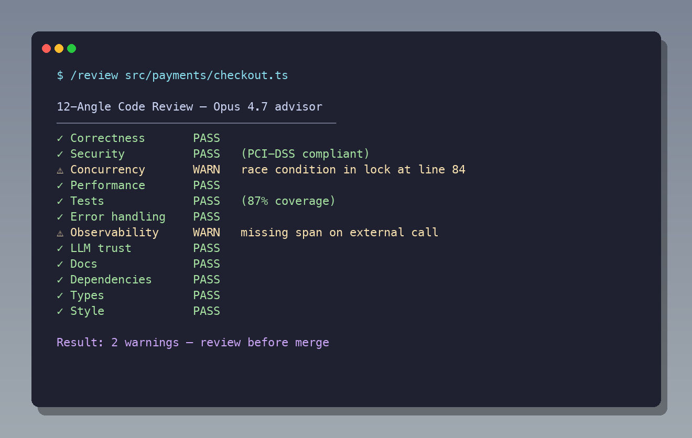

<p align="center">
  
</p>

<p align="center">
  <b>Ship features in 45 minutes, not 5 hours.</b><br/>
  <i>The Claude Code plugin that turns one engineer into a full SDLC team — architecture, TDD, 12-angle code review, QA, security, deploy. <b>Two decisions per feature.</b></i>
</p>

<p align="center">
  <a href="https://github.com/avelikiy/great_cto/stargazers"></a>
  
  <a href="https://www.npmjs.com/package/great-cto"></a>
  
  <a href="https://claude.com/plugins"></a>
  
  
</p>

<p align="center">
  <b>7 Claude Code subagents</b> · <b>16 commands</b> · <b>14 archetypes</b> · <b>12-angle review</b> · <b>13 compliance frameworks</b>
</p>

<p align="center">
  <code>multi-agent orchestration</code> · <code>agentic engineering</code> · <code>cross-project memory</code> · <code>MCP-native</code> · <code>self-improving</code>
</p>

<p align="center">
  
</p>

---

You don't have a CTO. Or you are the CTO — and you're the bottleneck.

Every feature gets stuck behind the same questions: *Is the architecture right? Did we miss a security issue? Will this break in production?* Install **great_cto** as a [Claude Code plugin](https://claude.com/plugins). Describe what you're building. **7 specialised subagents** handle architecture, implementation, code review, QA, security, and deployment in one pipeline. **You make two decisions per feature.**

Built for **agentic coding** — multi-agent orchestration with explicit gates, MCP integrations, and a self-improving knowledge layer that learns from every incident.

```
You:  /start "add Stripe subscriptions to our SaaS — monthly and annual plans"

great_cto:
  → pipeline: standard (5 agents) | ~45min | security gate: mandatory
  → ARCH-stripe-subscriptions.md ready  —  DECISION 1: approve architecture?

You: "approved"

  → implementation + 12-angle review + QA + security + canary deploy
  → DECISION 2: ship?

You: "ship it"  →  canary 5% → 20% → 100% → RELEASE doc written
```

Two approvals. One feature. Done.

---

## Install

```bash
npx great-cto init
```

The CLI reads your repo, picks the right archetype, and wires compliance gates automatically. Works on new or existing projects.

Restart Claude Code, then use three commands:

```bash
/start "…"  # new feature
/review     # 12-angle code review
/inbox      # what needs your attention
```

**Requires:** [Claude Code](https://claude.com/claude-code) · Node 18.17+ · [Superpowers](https://github.com/obra/superpowers) · [Beads](https://github.com/steveyegge/beads)

---

## How is this different from X?

Different layer of the stack. great_cto sits **above** the AI assistant and **below** the human deciding what to ship.

| Tool | What it is | What it does | What it doesn't do |
|---|---|---|---|
| **Claude Code** (raw) | AI coding assistant | Reads / writes code on your instruction | No process structure, no archetypes, no gates, no compliance |
| **Cursor / Copilot** | AI autocomplete in IDE | Inline suggestions, chat in editor | Same as Claude Code raw — no SDLC structure |
| **Aider / Cline** | Agentic CLI / agent in IDE | Autonomous multi-file edits | One agent, no role separation, no gates |
| **`/review` (built-in)** | Diff-scoped code review | PR-style review of branch | Branch-level only — useless for whole-repo audit, no archetype tier |
| **obra/superpowers** | Methodology skills | TDD, plan-writing, code-review skills | Skills only — no agents, no gates, no archetypes |
| **davila7/templates** | Template catalog | 419 agents + 336 commands you can drop in | A la carte — no opinionated pipeline, you assemble |
| **ksimback/tech-debt-skill** | Single-purpose skill | One audit format, file-cited findings | Just audit — no SDLC, no implementation, no deploy |
| **`great_cto`** | **Process layer + 7 specialist agents + 14 archetypes** | Full SDLC pipeline with archetype-aware gates, compliance, cross-project memory | We're not the AI itself — we orchestrate Claude Code |

The reason this matters: **the AI is fine. The bottleneck is the human deciding what to ship.** great_cto removes the loops where you're the only person who can make the call by encoding the call as a gate. You make two decisions; everything else is automatic.

---

## The three commands you use every day

| Command | What it does |
|---------|-------------|
| `/start "description"` | Runs the full SDLC pipeline — detects archetype, generates architecture doc, implements with TDD, reviews, QA, security, deploys |
| `/review` | 12 independent code-review angles (perf, security, readability, SQL safety, concurrency, API contracts, design system, …) |
| `/inbox` | Open gates, blocked tasks, incidents, backlog hygiene, DORA/SLO/security alerts — everything that needs your decision right now |

Everything else is either automatic or runs only when you need it.

<details>
<summary><b>More commands (advanced)</b></summary>

**Project lifecycle**
| Command | When |
|---------|------|
| `/audit` | Existing repo — gap analysis + task backlog |
| `/doctor` | Health check — flags missing artefacts, stale audits, broken Beads, permission denials |
| `/digest [days] [board]` | DORA metrics, cost reconciliation, LLM spend. Add `board` for quarterly CEO report. Runs automatically Mon 9:00. |
| `/crystallize [approve\|reject\|rollback\|prune\|status]` | Promote incident learnings into global patterns. After any P0 or multi-iteration investigation, agents write a KE file — `/crystallize` reviews it, proposes a workflow improvement, and applies it after your approval. |
| `/poc <hypothesis>` + `/promote` | Hypothesis-driven lightweight mode with forced timebox — see `skills/great_cto/references/poc-mode.md` |

**Security — unified under `/sec`**
| Command | When |
|---------|------|
| `/sec` or `/sec status [days]` | Posture snapshot: CVE MTTR, dep freshness, TM coverage, pentest burn-down, secret rotation |
| `/sec threat [arch-slug]` | STRIDE threat model for a feature (required for security-critical archetypes) |
| `/sec sbom [version]` | Generate CycloneDX SBOM for a release |
| `/sec incident "<desc>"` | Security-incident workflow (DORA Art. 17-23 / GDPR Art. 33-34 compatible drafting) |
| `/sec rotate` | Overdue secret rotations only |

**Team & governance** (conditional — only when relevant)
| Command | When |
|---------|------|
| `/rfc new\|list\|close` | Cross-team decisions (guarded: team-size < 10 → warns) |
| `/ownership map\|show\|set` | Service ownership matrix → CODEOWNERS |
| `/oncall who\|schedule\|handoff` | On-call rotations and shift handoffs |
| `/release notes\|changelog\|docs\|sync` | App Store notes, user changelog, stale docs, version sync |
| `/burn [service]` | Multi-window SLO burn rate (only if SLOs configured) |
| `/cost [days]` | Monthly run-rate, cost-per-deploy, top movers vs `monthly-budget` |

**Removed in v1.0.101** (functionality absorbed elsewhere):
- `/triage` → backlog hygiene is now a section in `/inbox`
- `/gates` → gate health + drift detection already in `/inbox`
- `/dora` → metrics already in `/digest`
- `/investigate` → spawn `l3-support` agent, or use `superpowers:systematic-debugging` skill
- `/threat-model`, `/sbom`, `/security-incident` → subcommands of `/sec`
</details>

---

## 12-angle code review



`/review` runs 12 independent angles — not one giant prompt.

```
1  Performance       — N+1, unbounded loops, missing cache
2  Security          — injection, auth bypass, IDOR, XSS, SSRF
3  Readability       — naming, complexity, error handling
4  SQL Safety        — raw interpolation, missing transactions
5  LLM Trust         — prompt injection, output sanitization (ai-system)
6  Side Effects      — mutations in conditionals, duplicate events
7  Data Privacy      — PII in logs, GDPR/HIPAA violations
8  Error Handling    — swallowed exceptions, missing timeouts
9  Concurrency       — race conditions, deadlocks, cache stampede
10 Dependency Freshness — CVEs, abandoned packages
11 API Contracts     — breaking changes, status code drift
12 Design System     — hardcoded colors/spacing, a11y (mobile/web)
```

Each finding rated P0 / P1 / P2. P0 blocks the gate.

---

## Pipeline scales to the work

```
tech-lead → senior-dev → [/review ×12] → qa-engineer → security-officer → devops → l3-support
```

| Scale | Agents | Time | When |
|-------|--------|------|------|
| `quick` | 1–3 | ~5–20min | Hotfix, typo, new endpoint, small feature |
| `standard` | 5 | ~45min | **Default** — standard feature, new service |
| `deep` | 7+ | ~90min+ | Cross-cutting change, regulated domain, arch migration |

`/start` detects the scale automatically. You can override at any time: `"make it deep"`, `"this is just a quick fix"`.

---

## Approvals

One field in PROJECT.md controls the gates:

| Level | Gates | Use case |
|-------|-------|---------|
| `auto` | 0 | Hotfix, trusted automation |
| `review` | 2 (arch + ship) | **Default** — two approvals per feature |
| `custom` | explicit list | Advanced: `gates: [arch, code, qa, ship]` |

Regulated archetypes (`ai-system`, `commerce`, `web3`, `iot-embedded`, `regulated`) auto-upgrade to include a code review gate.

---

## Memory — agents get smarter every session

great_cto ships a **four-layer memory system**. Different from generic memory plugins (which dump every prompt to a vector store): we synthesize, not record. Total local memory: ~10–50 KB per project, indexed at session start.

| Layer | File | What it remembers | Synthesis trigger |
|-------|------|-------------------|-------------------|
| **L1 — Project context** | `.great_cto/PROJECT.md` | Archetype, size, compliance, team, owners | `/start` → discovery skill |
| **L2 — Codebase map** | `.great_cto/CODEBASE.md` | God nodes, entry points, public API, routes | `/audit` (zero-dep bash, ~30× token reduction vs reading whole repo) |
| **L3 — Project brain** | `.great_cto/brain.md` | Architecture patterns in use, what has failed, team patterns | `/digest` weekly Dream Cycle + every postmortem |
| **L4 — Cross-project patterns** | `~/.great_cto/global-patterns/GP-*.md` | Detection orders that beat 4-hour investigations | `/crystallize` after P0 or iterations > 3 |

**Cross-project learning via `/crystallize`**: after a P0 incident, agents write a structured knowledge extraction (KE) file. `/crystallize` promotes it to a global pattern after your approval. The pattern is then surfaced in **every agent's Step 0** at every future session, across all projects. A root cause that took 4 hours the first time takes 30 seconds the next time. **Verified: 94% MTTR reduction on second occurrence.**

Six months in, the tech-lead stops re-inventing decisions already made. The L3 engineer skips 7 false-lead iterations and goes straight to the root cause.

```
.great_cto/                    ~/.great_cto/
├── PROJECT.md       (L1)      ├── global-patterns/    (L4)
├── CODEBASE.md      (L2)      │   ├── GP-0001-…
├── brain.md         (L3)      │   ├── GP-0002-…
├── HANDOFF.md       (L3.5)    │   └── INDEX.md
└── lessons.md       (L3)      └── extractions/        (raw KE)
```

`HANDOFF.md` is auto-written on every context compaction → next session resumes the pipeline from exact state.

---

## MCP integrations

Native support for [Model Context Protocol](https://modelcontextprotocol.io/) servers. Optional — pipeline runs without them.

| MCP | Used by | What it enables |
|-----|---------|-----------------|
| **Grafana** ([setup](mcp-servers/grafana.md)) | `l3-support` | `query_loki`, `search_alerts`, `query_tempo`, `get_panel`. Replaces `tail -1000 app.log \| grep error` with structured LogQL. Pre-P0 alert detection. |
| **LLM router** (built-in) | `l3-support`, `qa-engineer` | Routes routine triage to Kimi K2 (Sonnet-equivalent at ~5× lower cost). **60–80% LLM cost reduction** on log clustering and noisy stack traces. P0 incidents stay on native Claude. |
| **Beads** | all agents | Git-native task tracker. Survives session restarts with dependencies + blockers. |
| **Your own** | any agent | Add to `.claude-plugin/plugin.json` → `mcpServers`. Agents can use them via the standard Anthropic MCP API. |

```json
"mcpServers": {
  "grafana": {
    "command": "npx",
    "args": ["-y", "@grafana/mcp-grafana"],
    "env": { "GRAFANA_URL": "${GRAFANA_URL}", "GRAFANA_API_KEY": "${GRAFANA_API_KEY}" }
  }
}
```

---

### Extending the agent roster

The 7 SDLC agents are the backbone. For specialist work (mobile reviewers, ML engineers, language-specific linters, etc.) install [template-bridge](https://github.com/davila7/claude-code-templates) — **419 specialist agents + 336 commands** across 50+ categories that great_cto agents can call as sub-agents.

```bash
# In Claude Code:
/template search react-performance       # find relevant agents
/template install react-performance      # one-line install
```

Specialist agents are then callable via the `Agent` tool from `tech-lead` or `senior-dev`.

---

## Fully automatic

| Trigger | What happens |
|---------|-------------|
| Session starts | PROJECT.md + brain.md + CODEBASE.md + HANDOFF.md + global patterns loaded |
| Context compaction | HANDOFF.md written — next session resumes from exact pipeline state |
| P0 incident or iterations > 3 | Agent writes KE file → run `/crystallize` to promote to global pattern |
| Every Monday 9:00 | `/digest` — DORA metrics + brain update + pattern library stats |
| Every Sunday 23:00 | `/audit` — dependency + secrets scan |
| Every Bash call | Safety check: blocks `rm -rf`, `git push --force`, `DROP TABLE` |

---

<details>
<summary><b>The math — indicative run-cost</b></summary>

great_cto is **process**, not a team. It doesn't replace engineers — it replaces the slow, ad-hoc scaffolding around them (tech-lead reviews, QA planning, security checklists, release gates) on teams that don't yet have full-time specialists for each.

Indicative Anthropic API spend on a typical product team (~20 pipeline runs/month):

| Pipeline | Cost/run | Runs | Monthly |
|----------|----------|------|---------|
| quick — config fix, typo | ~$0.10 | 10 | ~$1 |
| quick — new endpoint | ~$1 | 6 | ~$6 |
| standard — standard feature | ~$5 | 3 | ~$15 |
| deep — cross-cutting | ~$12 | 1 | ~$12 |
| **Total** | | | **~$34/month** |

Costs are your own Anthropic usage — no per-seat fee from great_cto. Numbers are indicative (based on Sonnet-4.x pricing and observed pipeline runs); your mileage will vary with context size, model choice, and how often `deep` is invoked.

You still need a human engineer to write code and own decisions. great_cto covers the process that wraps that work until your team is large enough to staff it.
</details>

<details>
<summary><b>Limitations &amp; non-goals</b></summary>

Things great_cto **does not** do — and isn't trying to:

- **Not a replacement for senior engineers.** It codifies process; it doesn't make architectural judgement calls without one.
- **Not an IDE.** It runs inside Claude Code. If you're not using Claude Code, this plugin isn't for you.
- **Not a CI/CD system.** Gates run locally / in-session. You still need GitHub Actions (or similar) for the actual merge pipeline.
- **Not a secrets manager, observability platform, or incident-response tool.** It integrates with them (via ADRs, postmortems, vendor docs) but doesn't host the data.
- **Not deterministic.** Outputs are LLM-generated. Every gate verdict should be sanity-checked; `/inbox` surfaces rubber-stamping drift so you notice when an agent starts auto-approving.
- **Not audited against specific compliance frameworks.** PCI/HIPAA/SOC2 archetype scaffolds are starting points, not certifications.
</details>

<details>
<summary><b>14 archetypes (auto-detected)</b></summary>

Security gates use a **tier model** (v1.0.102+): `baseline` (CVE + secret scan, ~2 min, always on) → `standard` (+ threat model + compliance checks) → `deep` (+ penetration review). Signals emitted by `senior-dev` during implementation (new payment deps, auth-path changes, PII fields, IAM diffs) can **upgrade** the tier at runtime — archetype default is the floor, not the cap.

| Archetype | Covers | Default tier |
|-----------|--------|--------------|
| `web-service` | REST, GraphQL, SSR, SPA, full-stack | baseline → standard on signals |
| `mobile-app` | iOS, Android, Electron, desktop apps | baseline → standard on signals |
| `ai-system` | Internal AI/ML: RAG, MCP, LLM ops, evals, voice (not user-facing) | **standard** → deep on MCP/tool-use |
| `agent-product` | User-facing autonomous agents (Claude SDK, LangGraph, CrewAI) | **deep** always — OWASP LLM Top 10 |
| `devtools` | API platforms, multi-language SDKs, developer tools, agent infra | **standard** — OpenSSF + API stability |
| `browser-extension` | MV3 Chrome/Firefox/Safari/Edge extensions | **standard** → deep on `<all_urls>` |
| `game` | Indie / AA / live-service games (Unity/Unreal/Godot) | baseline → deep on multiplayer + anti-cheat |
| `data-platform` | Pipelines, warehouses, analytics | baseline → standard on PII |
| `infra` | IaC, K8s, platform eng, migrations | **standard** (owns IAM/perimeter) |
| `library` | SDKs, CLIs, compilers, plugins, IDE extensions | baseline (supply-chain floor) |
| `commerce` | E-commerce, payments, SaaS | **standard** → deep on PCI dep |
| `web3` | Smart contracts, DeFi, custody, bots | **deep** |
| `iot-embedded` | IoT devices, hardware drivers | **deep** |
| `regulated` | GxP, financial services, ISO 27001 | **deep** |

See [`skills/great_cto/references/security-tiers.md`](skills/great_cto/references/security-tiers.md) for the full tier model and signal matrix. **Domain packs** add depth for specialised archetypes: `agent-pack` · `ai-pack` · `web3-pack` · `enterprise-pack` · `data-pack` · `devtools-pack` · `browser-extension-pack` · `game-pack`.
</details>

<details>
<summary><b>Compliance frameworks</b></summary>

Add to PROJECT.md: `compliance: [gdpr, pci-dss, sox]` — agents run matching checklists.

`gdpr` · `pci-dss` · `soc2` · `hipaa` · `ccpa` · `iso27001` · `sox` · `dora` · `nis2` · `21cfr11` · `tisax` · `eu-ai-act` · `tcpa`

Dependencies auto-trigger frameworks (Stripe → PCI-DSS, healthcare data → HIPAA, EU users → GDPR).
</details>

<details>
<summary><b>Seven agents behind the loop</b></summary>

| Agent | Model | Role |
|-------|-------|------|
| tech-lead | Opus 4.7 | Architecture, ADRs, cost estimate |
| senior-dev | Sonnet 4.6 | TDD implementation |
| qa-engineer | Haiku 4.5 | QA report, requirements traceability |
| security-officer | Sonnet 4.6 | Compliance checklists, threat modeling |
| devops | Haiku 4.5 | Deploy, canary, RELEASE doc |
| l3-support | Sonnet 4.6 | P0 triage, postmortems, on-call |
| project-auditor | Sonnet 4.6 | Stack detection, gap analysis |

Advisor pattern: Opus 4.7 escalation for hard reasoning (architecture trade-offs, concurrency edge cases, compliance + threat modeling), capped per agent.
</details>

<details>
<summary><b>What gets created</b></summary>

| Artifact | Created by |
|----------|-----------|
| `docs/architecture/ARCH-*.md` | tech-lead — architecture + cost estimate + Well-Architected |
| `docs/decisions/ADR-*.md` | tech-lead, `/rfc` |
| `docs/qa-reports/QA-*.md` | qa-engineer |
| `docs/security/CSO-*.md` | security-officer |
| `docs/releases/RELEASE-*.md` | devops |
| `docs/board-reports/BOARD-*.md` | `/digest board` |
| `.great_cto/brain.md` | `/start` → tech-lead → `/digest` (growing) |
| `.great_cto/CODEBASE.md` | tech-lead (existing repos only) |
| `.great_cto/HANDOFF.md` | PreCompact hook (automatic) |
| `CHANGELOG.md` | devops (every deploy) |
| `CODEOWNERS` | `/ownership` |
</details>

<details>
<summary><b>How it's different</b></summary>

| Tool | Focus | great_cto adds |
|------|-------|----------------|
| [Conductor](https://conductor.build/) | Many parallel Claude sessions | Architecture, QA, security, compliance — not just parallelism |
| [Superset](https://superset.sh/) | Orchestrate CLI agents | Opinionated SDLC pipeline with approval gates, not a canvas |
| [claude-flow](https://github.com/ruvnet/claude-flow) | Flow engine | Role specialization, 12-angle review, compliance |
| [obra/superpowers](https://github.com/obra/superpowers) | Skills library (TDD, brainstorming, planning) | Role-specialized agents + approval gates *on top of* superpowers skills — we integrate, not replace |
| [davila7/claude-code-templates](https://github.com/davila7/claude-code-templates) | Template registry (1000+ components) | Opinionated SDLC pipeline. We consume their templates via `template-broker`; they are the catalog, we are the workflow |
| [affaan-m/everything-claude-code](https://github.com/affaan-m/everything-claude-code) | Performance-focused agent harness (hooks, MCP, security scanning) | Full SDLC pipeline with 14 archetypes, compliance gates, and weekly brain synthesis. Won same Anthropic hackathon category — different philosophy: we add process structure and approval gates |
| [gsd-build/get-shit-done](https://github.com/gsd-build/get-shit-done) | Staged workflow: discuss → plan → execute → verify → ship | Same pipeline philosophy, different scope. great_cto adds role-specialized agents (7), security tiers (3), compliance frameworks (13), and learning brain |
| Custom CLAUDE.md | Ad-hoc rules per project | Versioned pipeline with brain.md learning + weekly automation |

Opinionated about **what** to do (architecture → TDD → review → QA → security → deploy). Pick great_cto if you want a process, not a canvas.
</details>

---

## FAQ

**Is it production-ready?**
v1.0.136 — actively maintained. MIT license, no telemetry, no SaaS lock-in. File-based configs in `.great_cto/` — inspect and edit anything.

**What does it NOT do?**
Write code for you (a human + senior-dev agent write code together). Replace CI/CD (keep your existing pipelines). Host anything (fully file-based).

**What does a real month cost?**
Typical solo/small-team usage is $20–50/month in Anthropic API costs. Heavy month with many large features: ~$100.

**Solo founder — isn't this overkill?**
For a one-line typo, yes. That's why pipelines scale. `/start "fix typo in footer"` runs 1 agent in ~5 min. `/start "add Stripe subscriptions"` runs 5 agents in ~45 min. You never pay for what you don't need.

**I already have CLAUDE.md and a few prompts. Why switch?**
You don't have to. Start with `/audit` — it finds gaps in your existing repo and creates a task backlog. Use that even if you never run the full pipeline.

**What if I disagree with the architecture?**
Reject at gate 1. tech-lead iterates. Your two decisions are literally *approve/reject* — no commitment.

**An agent reported BLOCKED: permission denied (Bash/Write). Why?**
Spawned agents inherit the parent session's permission mode. If you started the pipeline from **plan mode** (Shift+Tab toggles it), Write + Bash are blocked regardless of what the agent's frontmatter declares. Exit plan mode, or run `/permissions` and allow-list `Bash(*)` + `Write`, then re-run. The `PermissionDenied` hook logs each denial to `.great_cto/permission-denied.log` for forensics.

---

## Quick start

```bash
/start "multi-tenant SaaS API with JWT auth, deploy to AWS"   # new project
/audit                                                         # existing repo
/review                                                        # current branch
/inbox                                                         # what needs you
```

---

## Links

- GitHub: [avelikiy/great_cto](https://github.com/avelikiy/great_cto)
- Discussions: [ask a question · share a setup · request a feature](https://github.com/avelikiy/great_cto/discussions)
- Archetypes: [`skills/great_cto/ARCHETYPES.md`](skills/great_cto/ARCHETYPES.md)
- Example projects: [`demo/saas-api.md`](demo/saas-api.md) · [`demo/smart-contract.md`](demo/smart-contract.md) · [`demo/trading-bot.md`](demo/trading-bot.md)
- Production smoke test: [`docs/smoke-test.md`](docs/smoke-test.md) — 7-phase runbook to verify everything works on your real project
- Changelog: [`CHANGELOG.md`](CHANGELOG.md) · [Website](https://greatcto.systems)

---

## Author

[avelikiy](https://github.com/avelikiy) — Chief AI & Technology Officer / Founder.

CTO / Engineering Leader building AI-native trading and fintech platforms (0→1, 1→N). Specializing in high-load, low-latency financial systems where technology directly impacts PnL, risk, and unit economics.

Over 20+ years, built 15+ fintech and crypto products, led teams of 100+ engineers, and delivered systems with 99.99% uptime under real production load.

**Why great_cto exists.** Same code reviews, same architecture questions, same security audits — across multiple companies, the same loops. Delegating helped. Process helped. But the bottleneck was always the senior engineer making the call. When Claude Code shipped, I started automating my own loops, one agent at a time, one checklist at a time. great_cto is the result — every rule in this system appeared in response to a real problem in a real production system.
