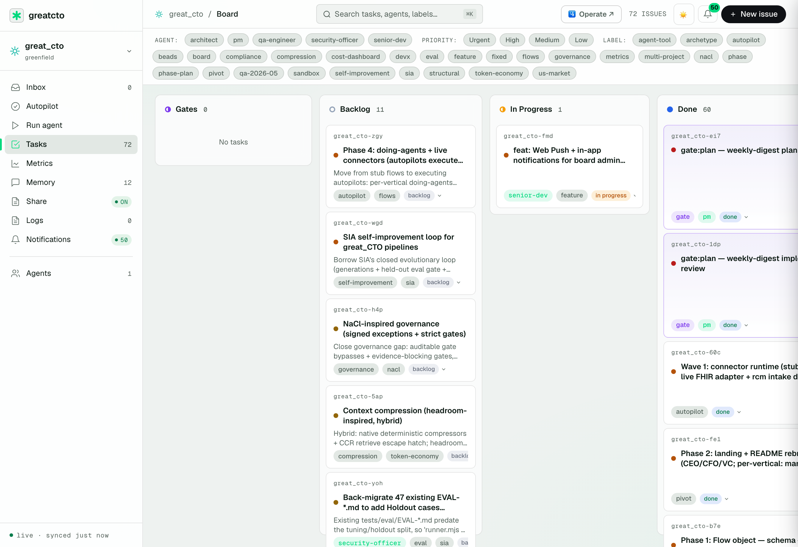
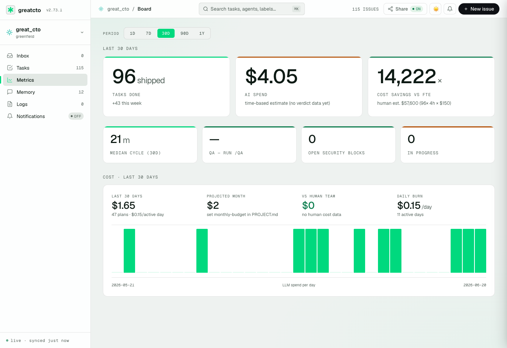
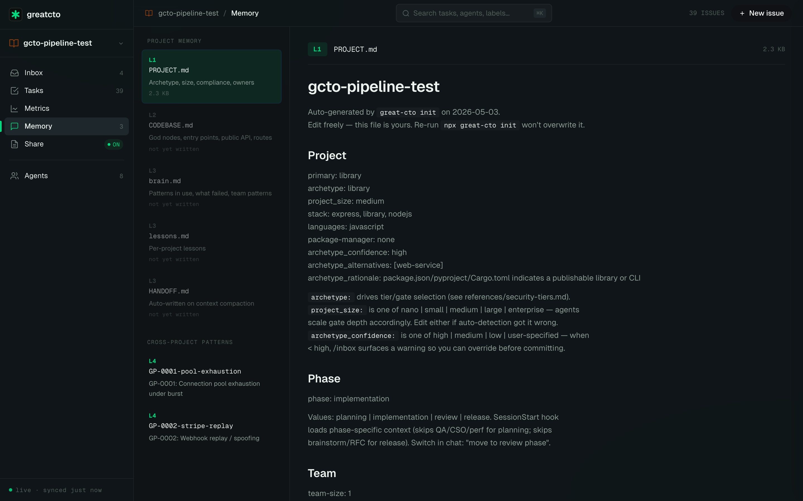

<div align="center">


**KI-Produkt-Builder — beschreibe ein Produkt, genehmige die Spezifikation, liefere die Software aus.**

[](https://www.npmjs.com/package/great-cto)
[](https://www.npmjs.com/package/great-cto)
[](../../LICENSE)
[](https://claude.com/plugins)
[](https://openai.com/codex)
[](https://greatcto.systems/proof)

```bash
npx great-cto init
```

[Website](https://greatcto.systems) · [Ein echter Durchlauf →](https://greatcto.systems/proof) · [Live-Demo](https://greatcto.systems/r/CsqYVXs1Vibac5yp) · [Diskussionen](https://github.com/avelikiy/great_cto/discussions) · [Changelog](../../CHANGELOG.md)

[Русский](../ru/README.md) · [简体中文](../zh-CN/README.md) · [繁體中文](../zh-TW/README.md) · [日本語](../ja/README.md) · [한국어](../ko/README.md) · [Español](../es/README.md) · [Português](../pt-BR/README.md) · [Deutsch](../de/README.md) · [Français](../fr/README.md)

</div>

---

## Baue das Produkt, nicht nur den Code

great_cto ist ein **KI-Produkt-Builder**. Beschreibe ein Software-Produkt, und es führt den gesamten
Build aus — Architektur, Datenmodell, Backend, Frontend, Tests, Deployment. **Ein menschliches Gate:** du,
der CTO, genehmigst die Spezifikation. Alles danach läuft automatisch – bis zum ausgelieferten Repo und einer Live-URL.

Die führenden US-Branchen, für die es baut — Haus- & Außendienste, professionelle Dienstleistungen,
Gastgewerbe, Retail/E-Commerce, PropTech, Fitness, Marketing & Creator, HR/Recruiting,
Bauwesen, Logistik — verdichten sich zu **6 wiederverwendbaren Build-Archetypen** (CRUD-Vertical-SaaS,
Booking, CRM, Dashboard, Marketplace, Content/Media). Ein Template liefert jedes der ~40 Produkte aus.
Siehe [docs/strategy/BUILD-PIPELINES.md](../strategy/BUILD-PIPELINES.md).

```
   describe a product
        │
   spec synthesis  ── architecture · data model · screens          (automated)
        ▼
   👤  CTO gate — approve the spec        ← the one human checkpoint
        │
   scaffold → backend → frontend → integrate → test → deploy        (automated)
        ▼
   shipped product · repo · live URL
```

CI und generierte Tests sind das Quality-Gate – du zeichnest die **Richtung** ab, nicht jede einzelne Zeile.

> **Operate** — die Runtime-Oberfläche, auf der ein Mensch jede regulierte Transaktion signiert (Operator-
> Konsole, Autopilot-Runtime, Vertical-Flows) — **ist in ein eigenes Repo umgezogen:**
> [github.com/avelikiy/operate](https://github.com/avelikiy/operate). great_cto ist jetzt das
> Build-Produkt.

## Unter der Haube (für den CTO, der es betreibt)

→ *Die Builder-Sicht auf diese Oberfläche: [greatcto.systems/build](https://greatcto.systems/build)*

Jedes Produkt wird von einer Pipeline aus Spezialisten-Agenten gebaut — Architekt, Design-Advisor, Senior-Dev,
QA, Security-Officer, DevOps — die spec → scaffold → backend → frontend → tests → deploy durchläuft.
**Du triffst eine Entscheidung: genehmige die Spezifikation.** Alles danach läuft automatisch. Die Pipeline ist
risiko-gestaffelt — ein Wartungs-Fix öffnet kein Gate (CI ist das Gate), ein reversibles Feature öffnet nur das
Plan-Gate, und eine irreversible Änderung erzwingt den vollen Satz — sodass die Ceremony mit dem Blast-Radius
skaliert, nicht mit dem Papierkram. CI und die selbst generierten Tests des Builds sind das Quality-Gate, das es sicher macht,
die Pipeline bis zum Deployment durchlaufen zu lassen.

**Empfohlenes Begleit-MCP: Serena (semantische Code-Navigation).** Auf großen Codebases verbrennen die
Code-schreibenden Agenten (Senior-Dev, Coder) Kontext mit grep und dem Lesen ganzer Dateien. Das
[Serena MCP](https://github.com/oraios/serena) gibt ihnen stattdessen Navigation auf Symbol-Ebene
(find-symbol, references, structure):

```bash
claude mcp add serena -- uvx --from git+https://github.com/oraios/serena \
  serena start-mcp-server --context ide-assistant --project "$(pwd)"
```

Optional — alles funktioniert auch ohne; mit ihm verbrauchen Implementierungs-Tasks auf großen Repos
spürbar weniger Kontext pro Edit.

**Ein Gate, dort wo es zählt.** Build-Schritte sind risiko-gestaffelt: eine reversible Änderung wird gebaut und ausgeliefert
hinter CI; eine irreversible — ein Production-Deploy, eine Schema-Migration, eine neue schreibfähige
Integration — eskaliert vor der Ausführung an das CTO-Gate und das Frontier-Modell. Du zeichnest die Spezifikation
und die Aufrufe mit hohem Blast-Radius ab; der Rest läuft durch. `change-tier` + `effectiveGates`
erzwingen die Invariante im Code.

## In Zahlen

| | |
|---|---|
| Ein Feature, end-to-end (echter Durchlauf, vollständig getraced) | **1h 26m · $3.40 LLM** vs. ~$42K / ~6 Wochen traditionell |
| Ein früherer CLI-Feature-Durchlauf, dieselbe Pipeline | $2.39 LLM vs. ~$5.460 menschliches Äquivalent; Security fing 2 Defekte ab, die QA durchgelassen hatte |
| Monatliche Kosten (20 Pipeline-Durchläufe) | **~$34** |
| Ziel-US-Branchen | **10** (Hausdienste · Retail · PropTech · Fitness · HR · …) |
| Baubare Produkte | **~40** über die 10 Branchen |
| Wiederverwendbare Build-Pipelines | **6** (CRUD · Booking · CRM · Dashboard · Marketplace · Content) |
| Spezialisten-Agenten | **46** |

→ [Vollständiger Trace mit allen Artefakten](https://greatcto.systems/proof) · [die 6 Pipelines](https://greatcto.systems/pipelines)

## So funktioniert es

**`npx great-cto init`** — scannt deinen Stack und schreibt `.great_cto/FLOW.md` mit der Pipeline für dein Produkt: die Agenten, der Build-Archetyp und das eine CTO-Gate.

**`/start "beschreibe das Produkt"`** — Architekt und Design-Advisor entwerfen Spezifikation, Datenmodell und Screens. Du prüfst und genehmigst sie am **einen Gate** — `gate:plan`.

**Die Pipeline liefert es aus** — Senior-Dev scaffoldet und baut mit TDD, QA führt die generierten Tests aus, DevOps deployt. Für einen reversiblen Build ist keine weitere Genehmigung nötig.

## Drei Produkte – eine Pipeline

Derselbe Befehl, ein anderes Produkt. Der Build-Archetyp formt Stack und Integrationen:

| | **Dispatch-App** | **Kursbuchungs-App** | **Profitabilitäts-Dashboard** |
|---|---|---|---|
| Archetyp | CRUD-Vertical-SaaS | Booking / Scheduling | Dashboard / Analytics |
| Stack | Next.js · Postgres · shadcn | Next.js · Postgres · cal | Next.js · warehouse-lite · charts |
| Integrationen | Auth · RBAC | Stripe · Twilio | Source-Connectoren |
| Menschliche Gates | `gate:plan` (das CTO-Gate) | `gate:plan` | `gate:plan` |

→ Sieh dir die 6 Pipelines an: [greatcto.systems/pipelines](https://greatcto.systems/pipelines)

## Das Dashboard, das du wirklich prüfen wirst

`great-cto board` öffnet sich unter `http://localhost:3141` — das Build-Board: Echtzeit-SSE, die Live-Pipeline mit ihrem change_tier-Badge (ein CTO-Gate · günstiger Judge), Kosten pro Agent, 30-Tage-LLM-Ausgaben vs. menschliche Äquivalenz-Baseline.

<p align="center">
  
</p>

<table>
<tr>
<td width="50%"><a href="docs/screenshots/metrics.png"></a><br/><sub><b>Metriken</b> — ausgelieferte Tasks, KI-Ausgaben, Kosteneinsparung vs. ein menschliches Team, täglicher Burn</sub></td>
<td width="50%"><a href="docs/screenshots/memory.png"></a><br/><sub><b>Memory</b> — durchstöberbare Projekt-Memory-Schichten: PROJECT.md, Archetypen, Skills, Lessons</sub></td>
</tr>
</table>

**Gebaut für die Ein-Personen-Engineering-Organisation.** GreatCTO ist für den Indie-Hacker, Solo-Gründer oder technischen CTO, der echte Produkte ohne Team ausliefern will – die Pipeline läuft auf Claude Code oder OpenAI Codex, eine Spezifikation wird genehmigt, und das Ergebnis geht an eine Live-URL. *Nicht für Multi-Dev-Engineering-Teams* – siehe [FAQ](../FAQ.md#is-great_cto-for-teams).

## Installation

```bash
npx great-cto init
```

Starte deinen KI-Host nach dem Init neu. **Voraussetzungen:** Node 18.17+ und eines von:

| Host | Install-Flag | Status |
|---|---|---|
| [Claude Code](https://claude.com/claude-code) | _(Standard)_ | ✅ volle Unterstützung |
| [OpenAI Codex](https://openai.com/codex) | `--host codex` | ✅ Hooks + MCP + Agenten |

```bash
# Claude Code (default)
npx great-cto init

# OpenAI Codex Desktop / CLI
npx great-cto init --host codex
```

Die Begleit-Plugins Superpowers und Beads installieren sich automatisch – kein manuelles Setup nötig.

---

<details>
<summary>📖 Vollständige Dokumentation — ein CTO-Gate · Risiko-Tiering · Kritiker · 46 Agenten · Build-Archetypen · Board · Kosten · MCP</summary>

## Eine Entscheidung pro Feature

```
🤖 architect + design-advisor  →  spec · data model · screens
   ↓
🟡 gate:plan   ←  you decide here — approve the spec (the one CTO gate)
   ↓
🤖 senior-dev → review → qa-engineer → devops  →  built · tested · deployed
```

Die Pipeline ist risiko-gestaffelt (`change_tier`): ein Wartungs-Fix öffnet **kein** Gate (CI ist das Gate), ein reversibles Feature öffnet **nur** `gate:plan`, und eine irreversible Änderung erzwingt den vollen Satz + das Frontier-Modell. Alles zwischen dem Gate und dem Deployment läuft automatisch. **Memory bleibt erhalten** zwischen Sessions: jedes Gate-Urteil wird an `~/.great_cto/decisions.md` angehängt, jede Retrospektive an die projektspezifische `lessons.md`, und `/crystallize` befördert Muster mit hoher Wirkung in eine globale Bibliothek, die Agenten abfragen, bevor sie ein Problem erneut lösen.

## Kritiker vor dem Plan

Die teuersten Bugs stecken nicht im Code – sie stecken in Entscheidungen, die vor Beginn des Codings getroffen werden. Drei Kritiker-Agenten laufen vor der Plan-Phase, an den drei Stellen, an denen ein Fehler am meisten kostet:

| Kritiker | Fängt ab |
|---|---|
| **Architektur-Kritiker** | Kopplung, die Multi-Tenancy später ausschließt · "offensichtliches" O(n²) auf real-skalierten Daten · zirkuläre Abhängigkeiten zwischen Bounded Contexts |
| **Spec-Kritiker** | "Wir haben das falsche Problem gelöst" – die schlimmste Bug-Klasse, weil kein Unit-Test sie fängt · fehlausgerichtete Akzeptanzkriterien · Scope, der nie vereinbart wurde |
| **Schema-Kritiker** | `NOT NULL` ohne Default auf einer Tabelle mit 50M Zeilen (Deadlock 10 Min. nach Deploy) · fehlendes `CONCURRENTLY` bei der Index-Erstellung · irreversible Migrationen ohne Rollback-Pfad |

Früher wurden Kritiker erst ab dem Plan aktiviert. Jetzt fängt die Pipeline Architektur- und Spezifikationsfehler ab, bevor die Implementierung beginnt – wenn ein Rückgängigmachen Stunden kostet, nicht Tage.

## Wie great_cto im Vergleich abschneidet

|  | **great_cto** | Devin | Claude Code (allein) |
|---|---|---|---|
| Open Source | ✅ MIT | ❌ closed | ❌ geschlossenes Plugin-Modell |
| Self-Host | ✅ läuft lokal | ❌ Cognition Cloud | ✅ |
| Host | ✅ Claude Code + Codex | ❌ Cognition Cloud | ✅ Claude Code |
| BYOK / Multi-Model | ✅ Claude Code · Codex | ❌ proprietär | ❌ nur Anthropic |
| Spezialisten-Agenten | **46** (Architekt · Design-Advisor · Senior-Dev · QA · Security · DevOps · Archetyp-Reviewer) | 1 Generalist | 1 Generalist |
| Build-Pipeline | spec → CTO-Gate → scaffold → build → test → deploy | One-Shot-Autonomie | Edit-Loop |
| Menschliche Gates | ✅ eines — du genehmigst die Spezifikation (risiko-gestaffelt) | ❌ keine | ❌ |
| Memory über Sessions hinweg | ✅ `decisions.md` + `lessons.md` + crystallize | ⚠️ nur Thread | ⚠️ nur Thread |
| Kostenverfolgung | ✅ pro Agent + 30-Tage-Historie + savings_x | ❌ | ❌ |
| Design eingebaut | ✅ design-advisor + ui-ux-pro-max → Next.js/Tailwind/shadcn | ❌ | ❌ |
| Preis | kostenlos (du zahlst deinen LLM-Anbieter) | $500/Mon. | $20/Mon. |
| Setup | `npx great-cto init` | Anmeldung | CLI installieren |

great_cto ist **kein** weiterer Coding-Agent-Loop – es ist die **Orchestrierungsschicht über** dem Coding-Agenten, den du bereits nutzt. Denk an "Spezialisten-Team, das die Arbeit prüft und gatet" statt an "noch ein Assistent, der Code tippt".

## Jurisdiktionserkennung

`npx great-cto init` scannt drei Signalquellen – README-Schlüsselwörter, Infra-Region-Strings (Terraform, `.env` `AWS_REGION=`, docker-compose `TZ=`) und die `package.json`-Homepage-TLD – und erkennt automatisch, welche der **12 Jurisdiktionen** zutreffen:

| Jurisdiktion | Signale (README + Infra) | Frameworks | Reviewer |
|---|---|---|---|
| `eu` | gdpr · eu users · nis2 · eu ai act · `eu-west-*` · `.de` TLD | GDPR · EU AI Act · NIS2 · ePrivacy | `gdpr-reviewer` |
| `us-ca` | ccpa · cpra · california residents · do not sell | CCPA / CPRA | `us-privacy-reviewer` |
| `uk` | uk gdpr · information commissioner · dpa 2018 | UK GDPR · DPA 2018 | `gdpr-reviewer` |
| `in` | dpdpa · india users · rbi data localisation | DPDPA 2023 · RBI | `dpdpa-reviewer` |
| `br` | lgpd · anpd · brazil users | LGPD | `gdpr-reviewer` |
| `au` | privacy act 1988 · oaic · notifiable data breach | Privacy Act 1988 · CDR | `us-privacy-reviewer` |
| `sg` | pdpa · pdpc · mas guidelines · singpass | PDPA · MAS TRM | `us-privacy-reviewer` |
| `ca` | pipeda · quebec law 25 · casl · canadian users · `ca-central-*` | PIPEDA · Quebec Law 25 · CASL · OSFI B-10 | `us-privacy-reviewer` |
| `jp` | appi · japan users · my number · `ap-northeast-1` · `japaneast` | APPI 2022 · PPC Guidelines · FISC | `us-privacy-reviewer` |
| `cn` | pipl · mlps · china users · `cn-north-*` · `cn-east-*` | PIPL 2021 · DSL 2021 · MLPS 2.0 · CBDT | `gdpr-reviewer` |
| `kr` | pipa korea · isms-p · kisa · korea users · `ap-northeast-2` | PIPA · ISMS-P · FSC regulations | `us-privacy-reviewer` |
| `us` | ftc · us users · virginia cdpa · texas tdpsa | FTC Act · US state privacy laws | `us-privacy-reviewer` |

Word-Boundary-Matching verhindert False Positives (`"india"` matcht nicht `"indiana"`). Die erkannte Jurisdiktion wird in `PROJECT.md` als `jurisdiction: [eu, us-ca]` geschrieben und gatet den passenden Reviewer bei jedem Feature. Manuell überschreiben:

```yaml
jurisdiction: [eu, us-ca]
```

## Drei Befehle, die du jeden Tag nutzt

```bash
/start "build a dispatch & scheduling app for an HVAC business"
# → architect + design-advisor → spec, data model, screens
# → pm → Beads tasks → gate:plan (you approve the spec — the one gate)
# → senior-dev → review → qa → devops → built · tested · deployed

/inbox
# Pending gate · P0 incidents · blocked tasks · stale in-progress

/digest
# Weekly DORA + delta vs last week + cost-per-feature roll-up
```

Außerdem: `/audit` (Scan bestehender Codebases), `/cost` (LLM-Router-Einsparungen), `/sec` (Security-Schirm), `/oncall`, `/release`, `/rfc`. Vollständige Liste: `~/.claude/commands/` nach der Installation.

## Kosten

```
~$34/month for a typical solo-CTO project — 20 pipeline runs/month, indicative.
```

| Pipeline | Kosten/Durchlauf | Durchläufe/Mon. | Gesamt |
|---|---|---|---|
| quick (Config / Tippfehler) | $0.10 | 10 | $1 |
| quick (neuer Endpoint) | $1 | 6 | $6 |
| standard (Feature) | $5 | 3 | $15 |
| deep (übergreifend) | $12 | 1 | $12 |
| | | | **~$34** |

Bezahle deine eigenen Anthropic-API-Tokens. **Keine Gebühr pro Sitzplatz. Kein SaaS-Lock-in.** Routine-Triage wird automatisch zu Kimi K2 geroutet (Sonnet-äquivalent bei ~5× niedrigeren Kosten) → 60–80 % Reduktion beim Log-Clustering.

## Build-Archetypen

Jedes Produkt bildet sich auf einen **Build-Archetyp** ab, der seine Pipeline formt — das Stack-Template,
die Datenform, die signaturgebende Integration. Die 6 Product-Builder-Archetypen (die ~40 Produkte
verdichten sich zu diesen):

| Archetyp | Form | Stack | Integration |
|---|---|---|---|
| `vertical-saas` | entities · roles · workflow · records UI | Next.js · Postgres · shadcn | Auth · RBAC |
| `booking` | calendar · availability · reminders · payments | Next.js · Postgres · cal | Stripe · Twilio |
| `crm` | contacts · pipeline · automated sequences | Next.js · Postgres · queue | email / SMS · webhooks |
| `dashboard` | ingest · metrics · visualization · alerts | Next.js · warehouse-lite · charts | source connectors |
| `marketplace` | two-sided listings · matching · payments | Next.js · Postgres · Stripe Connect | Stripe Connect / escrow |
| `content` | catalog · access tiers · delivery · monetization | Next.js · object storage · CDN | Stripe · media pipeline |

Hinzu kommen die zugrunde liegenden Software-Kind-Archetypen (`web-service`, `mobile-app`, `cli-tool`,
`library`, …), die die Engine automatisch erkennt, um den Build feinzujustieren. Siehe [die 6 Pipelines](https://greatcto.systems/pipelines).

Vollständige Tabelle (26 Archetypen) + wie die Erkennung funktioniert: [docs/ARCHETYPES.md](../ARCHETYPES.md).

**Tiefe US-Abdeckung** – über GDPR/PCI/HIPAA hinaus prüft great_cto jetzt gegen SEC-Cyber-Disclosure (8-K Item 1.05), CMMC 2.0 / NIST 800-171 für Verteidigungsauftragnehmer, US-KI-Governance (NIST AI RMF · Colorado SB 205 · Utah/Texas AI), Web-Tracking-Klagen (VPPA · CIPA · Washington MHMDA) sowie HMDA / SR 11-7 Modellrisiko bei Kreditvergabe.

## Domain-Overlays (optional)

Über den Build-Archetyp hinaus kann die Engine automatisch ein optionales **Domain-Overlay** anhängen, wenn sie
domänenspezifische Signale erkennt (Dependencies, README-Begriffe) — und fügt einen Spezialisten-Reviewer und ein paar
zusätzliche Checks für Dinge wie Voice/Telephony, Datenschutz (GDPR/CCPA) oder KI-Governance hinzu. Sie sind
opt-in und orthogonal zur Build-Pipeline; die meisten Produkte brauchen keines.

## Ein echter Durchlauf, vollständig getraced

Der kanonische Beleg: **ein echtes Feature** durch die komplette Pipeline versandt in **1h 26m
Wall-Clock für $3.40 an LLM-Kosten** — Architekt → Plan → Implementierung → Review → menschliches Gate →
gemergter PR. Der traditionelle Weg für dasselbe Feature: ~170 Stunden und ~$42K. Jede Phase
mit Zeitstempel, jedes Artefakt verlinkt auf einen öffentlichen GitHub-PR.

Ein früherer Durchlauf an einem Python-CLI-Feature ($2.39 vs. ~$5.460 menschliches Äquivalent) zeigte das Review-Modell in Aktion: Security fing zwei echte Defekte ab, die QA durchgelassen hatte (`list(stream_csv())` hat das Streaming ausgehebelt → 14,5 MB Peak-RSS bei 13 MB Input).

Vollständiger Trace + Artefakte: [greatcto.systems/proof](https://greatcto.systems/proof) · roh: [`docs/qa/runs/2026-05-09/E2E-CLI-PIPELINE.md`](../qa/runs/2026-05-09/E2E-CLI-PIPELINE.md).

## CI-Integration

Lässt sich in jeden GitHub-Actions-Workflow einbinden:

```yaml
- run: npx great-cto@latest ci ./ --sarif results.sarif
- uses: github/codeql-action/upload-sarif@v3
  if: always()
  with: { sarif_file: results.sarif }
```

`great-cto ci` erkennt `$GITHUB_ACTIONS` automatisch und gibt `::error file=...,line=N::`-Annotationen direkt auf PR-Diffs aus. Exit-Codes: 0 sauber / 1 Funde / 2 Setup-Fehler.

## Test-Pyramide

Geschichtete Test-Suite – **die strukturelle + State-Machine-Ebene läuft in <2 Min. für $0** (`node --test tests/*.test.mjs`); die Echt-LLM-Ebene (26 Archetypen × 4–8 Stufen + 14 Packs + 13 Reviewer) läuft on-demand über OpenRouter für ~$5–10. Vollständige Aufschlüsselung: [docs/testing/](../testing/).

## MCP

Nativer [MCP](https://modelcontextprotocol.io/)-Server – **7 Tools** aufrufbar aus Claude Desktop, Codex oder jedem MCP-Host. Lokal (kein Board nötig): `detect_archetype` · `estimate_cost` · `query_decisions`. Board-gestützt: `project_status` · `cost_summary` · `pipeline_stages` · `recent_verdicts`.

```json
{ "mcpServers": { "great-cto": { "command": "npx", "args": ["-y", "great-cto@latest", "mcp"] } } }
```

Vollständiges Setup + interne MCPs (Grafana, LLM-Router, Beads): [docs/MCP.md](../MCP.md).

## E-Mail-Benachrichtigungen (Zero-Setup)

Fünf Dinge, bei denen du in <2 Std. handeln musst, werden automatisch per E-Mail gesendet – auch wenn du nicht am Board bist:

| Trigger | Wann |
|---|---|
| 🚨 **P0-Vorfall** | Ein P0-Task wird in irgendeinem Projekt geöffnet |
| ⏸️ **Gate steht > 2 Std.** | Ein `gate:ship` wartet seit Stunden auf dich |
| 🛡️ **Security BLOCKED** | `security-officer` hat einen Merge abgelehnt |
| 💸 **Budget-Alarm** | Monatliche LLM-Ausgaben überschreiten 80 % / 100 % des Budgets |
| 📊 **Wöchentlicher Digest** | Freitag 09:00 – versandt, ausgegeben, eingespart, QA |

**Setup**: Board → **Notifications**-Tab → E-Mail eingeben → den 6-stelligen Code eingeben, den wir senden → Trigger auswählen. Keine Resend-Anmeldung, keine API-Keys – die Zustellung wird über `greatcto.systems/notify` geroutet (kostenlos, 100 E-Mails/24 Std. pro verifizierter E-Mail).

## Einschränkungen & Nicht-Ziele

- **Nicht für Multi-Dev-Engineering-Teams** – ein Builder ist das Produkt; 2+ Engineers, die sich die Pipeline teilen, sind herausgewachsen.
- **Kein Ersatz für Senior Engineers** – kodifiziert Prozesse; trifft ohne einen solchen keine architektonischen Ermessensentscheidungen.
- **Kein CI/CD-System** – Gates laufen lokal / in der Session. Für den eigentlichen Merge brauchst du weiterhin GitHub Actions.
- **Nicht zertifizierungsauditiert** – PCI/HIPAA/SOC2-Archetyp-Gerüste sind Ausgangspunkte, keine Zertifizierungen.
- **Nicht deterministisch** – LLM-generierte Ausgaben. Jedes Gate-Urteil sollte einem Plausibilitätscheck unterzogen werden.

## FAQ (Top 5)

**Wird mein Quellcode zum Trainieren von Modellen verwendet?** Nein. Die Claude-API ist für zahlende Kunden standardmäßig Zero-Retention. great_cto fügt nichts hinzu.

**Wie haltet ihr die Token-Kosten niedrig?** Haiku-by-default + Kimi-K2-Router für Triage (60–80 % Einsparung) + Cost-Guard-Hook.

**Kann ich Hooks deaktivieren?** Jeder Hook respektiert `GREAT_CTO_DISABLE_<NAME>=1`. Pro-Datei-Opt-out beim Secret-Scan: `// great_cto:allow-secrets`.

**Was, wenn ich nicht solo bin?** Die Build-Pipeline von GreatCTO ist für einen Engineer gebaut – wenn du 2+ Engineers hast, die gemeinsame Builder-Boards und parallele Pipelines brauchen, bist du herausgewachsen.

Vollständige FAQ: [docs/FAQ.md](../FAQ.md).

## Dokumentation

📚 **[Vollständiger Dokumentations-Hub →](../README.md)** – organisiert nach [Diátaxis](https://diataxis.fr/):
**[Erste Schritte](../tutorials/getting-started.md)** · How-to-Guides ·
[Agenten](../reference/agents.md)- & [Befehle](../reference/commands.md)-Referenz · [Architektur](../ARCHITECTURE.md) · [FAQ](../FAQ.md).

## Architektur

Das Plugin läuft innerhalb von Claude Code (oder jedem MCP-fähigen Host); 46 Agenten sind Markdown-Spezifikationen; Aufgaben liegen in Beads (dolt, git-nativ); Memory ist reines Markdown (kein Vector Store). Diagramm + Stack-Tabelle: [docs/ARCHITECTURE.md](../ARCHITECTURE.md).

## Was ist neu

**v2.74+** (Juni 2026) – **Der Product-Builder-Pivot**: GreatCTO wird zu einem *KI-Produkt-Builder* – beschreibe ein Software-Produkt, genehmige die Spezifikation an einem CTO-Gate, und die Pipeline liefert es aus (spec → build → test → deploy). 10 US-Branchen, ~40 Produkte, 6 wiederverwendbare Pipelines. Build-Gates sind risiko-gestaffelt (`change_tier`); die regulierte Runtime-Oberfläche ist nach [avelikiy/operate](https://github.com/avelikiy/operate) ausgelagert. Story: [die Strategie](../strategy/PRODUCT-BUILDER-DIRECTION.md) · [die 6 Pipelines](https://greatcto.systems/pipelines)

**v2.40–v2.62** (Juni 2026) – **Der Autopilot-Pivot**: GreatCTO wird zu *KI-Autopiloten fürs Business* – 25 Service-Autopilot-Verticals, jeder ein Flow mit gemessenem Quality-Scorecard, einem verantwortlichen Owner und der Runtime-Invariante, dass **eine irreversible Aktion niemals ohne menschliche Signatur ausgeführt wird**. 22 Live-Connectoren betreiben jedes Vertical mit echten Daten. Story: [Wir haben pivotiert →](https://greatcto.systems/blog/autopilots-pivot-25-verticals)

**v2.46–v2.63** (Juni 2026) – **Die Operator-Konsole**: durable Runs pausieren am menschlichen Gate und warten in einer Inbox auf einen namentlich genannten lizenzierten Menschen; das Signieren führt den Write aus. Rollenbasierter Zugriff, gescopte Einladungen, KI-entworfene Determinations mit Evidenz, QA-Sampling, SLA-Uhren, Ops-Tab (Metering · Connector-Health · Dead-Letter-Requeue), WCAG 2.2 AA, Hell/Dunkel. Story: [Die Operator-Konsole →](https://greatcto.systems/blog/operator-console)

**v2.37–v2.65** (Juni 2026) – **Unter der Haube**: das Dev-Board wird zu einem *Pult* – das Genehmigen eines Gates kann einen live gestreamten Agent-Run starten; Prompt-Selbstverbesserung gegated auf Held-out-Evals (SIA-inspiriert); $0-Kontextkompression (CI-Log 31.475 → 155 Zeichen mit erhaltenem FATAL); Fable-5-Support. Story: [Juni unter der Haube →](https://greatcto.systems/blog/june-under-the-hood)

[Vollständiges Changelog →](../../CHANGELOG.md)

## Roadmap

- **Produkt-Archetyp-Erkennung** – den Build-Archetyp aus dem Produkt-Brief wählen, nicht nur aus dem Stack
- **Build-Templates pro Branche** – ein Referenzprodukt end-to-end durch jede der 6 Pipelines ausliefern
- **Tier-bewusster Judge** – ein günstiger, feinjustierter Judge auf T0/T1-Evals, Frontier + Mensch bei T2 (ADR-004)
- **Headless-Task-Runner** – Produkt-Builds in eine Queue stellen und unbeaufsichtigt auf einem VPS laufen lassen

[Über das nächste Feature abstimmen →](https://github.com/avelikiy/great_cto/discussions/categories/ideas)

</details>

## Autor

[avelikiy](https://github.com/avelikiy) – CTO, der KI-native Trading- und Fintech-Plattformen baut (0→1, 1→N). great_cto ist das Ergebnis der Automatisierung meiner eigenen Loops, ein Agent nach dem anderen. Jede Regel ist als Reaktion auf ein echtes Problem in einem echten Produktionssystem entstanden.

## Community

| Kanal | Wofür |
|---|---|
| 🐛 [Issues](https://github.com/avelikiy/great_cto/issues) | Bugs, Feature-Requests, Archetyp-Vorschläge |
| 💡 [Discussions](https://github.com/avelikiy/great_cto/discussions) | Fragen, Muster, Show-and-Tell |
| 📝 [Blog](https://greatcto.systems/blog/) | Belege, Kostenaufschlüsselungen, Architektur-Deep-Dives |
| 🔒 [SECURITY.md](../../SECURITY.md) | Verantwortungsvolle Offenlegung |

## Mitwirken & Lizenz

Pull-Requests sind willkommen – siehe [CONTRIBUTING.md](../../CONTRIBUTING.md). Gute erste Issues: [`good-first-issue`](https://github.com/avelikiy/great_cto/issues?q=is%3Aopen+label%3Agood-first-issue).

MIT – siehe [LICENSE](../../LICENSE).

Wenn great_cto dir Zeit gespart hat, gib dem Repo bitte einen Stern – das hilft anderen Solo-CTOs, es zu finden.

[](https://star-history.com/#avelikiy/great_cto&Date)

---

<div align="center">

**Gebaut von [@avelikiy](https://github.com/avelikiy)**
*Hör auf, die einzige Person zu sein, die ausliefern kann.*

</div>
