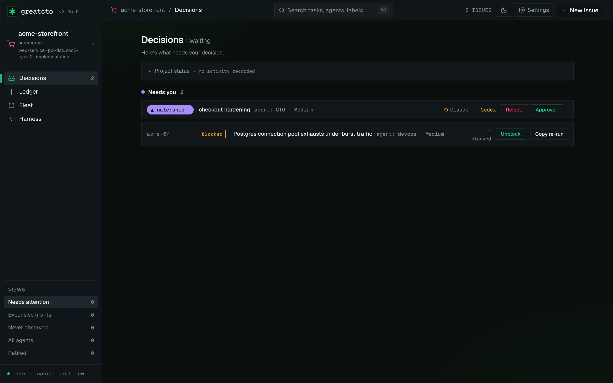

<div align="center">


**Liefere Produkte mit dem Coding-Agenten, den du schon hast.**

[](https://www.npmjs.com/package/great-cto)
[](https://www.npmjs.com/package/great-cto)
[](../../LICENSE)
[](https://claude.com/claude-code)

```bash
npx great-cto init
```

[Website](https://greatcto.systems) · [Ein echter Lauf →](https://greatcto.systems/proof) · [Live-Demo](https://greatcto.systems/r/CsqYVXs1Vibac5yp) · [Blog](https://greatcto.systems/blog/) · [Changelog](../../CHANGELOG.md)

</div>

> Übersetzung des englischen [README](../../README.md), Stand **v2.90.0** (2026-07-30). Die Anzahl der Freigaben wurde auf den aktuellen Standard (drei) aktualisiert.
> Bei Abweichungen gilt die englische Fassung.

---

great_cto ist die **Orchestrierungsschicht über dem Coding-Agenten, den du
bereits nutzt**. Eine Pipeline aus **69 Spezialagenten** — architect,
design-advisor, senior-dev, code-reviewer, QA, security, devops — plant, baut,
reviewt und deployt eine echte Anwendung: Backend, Frontend, generierte Tests,
Live-URL.

Du wirst genau zweimal angehalten: einmal bei **was gebaut wird**, einmal bei
**ob es live geht**. Alles dazwischen läuft ohne dich.

```
   Produkt beschreiben
        │
   🤖  Spezifikation · Architektur · Datenmodell · Screens
        ▼
   👤  Checkpoint 1 — WAS gebaut wird genehmigen
        │
   🤖  architecture · data model · screens
        ▼
   👤  Checkpoint 2 — WIE gebaut wird genehmigen
        │
   🤖  Scaffold → Backend → Frontend → Tests → Review → Security
        ▼
   👤  Checkpoint 3 — Deploy genehmigen
        │
   🤖  deployed · Repository · Live-URL
```

<p align="center">
  
</p>

Das Board auf `localhost:3141` füllt sich selbst — Pipeline-Zustand, offene
Gates, Kosten pro Agent, 30-Tage-Ausgaben. Du fütterst es nicht; du schaust
darauf.

## Gemessene Zahlen

| | |
|---|---|
| Ein Feature, Ende zu Ende, voll nachvollziehbar | **1h 26m · $3.40** in Tokens — [die Belege](https://greatcto.systems/proof) |
| Ein ganzes Produkt — 7 im offenen Benchmark gebaut | Median **$171** in Tokens · Qualität **70/100** (58–86) — [selbst reproduzieren](../benchmarks/BENCH-2026-07-batch1.md) |
| Typischer Monat, 20 Pipeline-Läufe | **~$34** — du zahlst nur deinen LLM-Anbieter |
| Produkte, die es bauen kann | **60**, in 15 US-Branchen, über [6 wiederverwendbare Pipelines](https://greatcto.systems/pipelines) |

Der Qualitätswert entsteht durch das Ausführen der Tests jedes Produkts, nicht
durch das Zählen von Dateien — deshalb lautet er 70 und nicht eine rundere,
hübschere Zahl.

## Schnellstart

```bash
npx great-cto init            # Claude Code (Standard) · für OpenAI Codex: --host codex
```

AI-Host neu starten, dann:

```bash
/start "baue eine Dispatch- und Termin-App für einen HVAC-Betrieb"
```

Ab da übernimmt die Pipeline. Im Alltag berührst du drei Dinge:

| | |
|---|---|
| `/start "…"` | Produkt oder Feature beschreiben — die Pipeline führt aus |
| `/inbox` | was auf dich wartet: Gates, P0s, blockierte Aufgaben |
| `/digest` | wöchentliche DORA-Metriken + Kosten pro Feature |

Benötigt Node ≥ 18.17. Begleit-Plugins (Superpowers, Beads) installieren sich
selbst. Nach dem init prüfe, ob der Host das Plugin wirklich geladen hat:
`claude plugin list --json` darf für `great_cto` keine `errors` zeigen.

## Wann es dich fragt

Eine Einstellung in `.great_cto/PROJECT.md` bestimmt, wo die Pipeline anhält:

| `approval-level` | Hält an bei | Pro Feature |
|---|---|---|
| `product-only` | was wir bauen · ob es live geht | 2 |
| `gates-only` *(Standard)* | dem Design · dem Deploy | 2 |
| `strict` | + Code-Review | 3 |
| `auto` | nichts | 0 |

Ein regulierter Archetyp — Fintech, Gesundheit, Behörden — behält seine
Security-, Compliance- und Ship-Gates **auf jeder Stufe, auch bei `auto`**. Eine
leichtere Stufe delegiert Urteilsvermögen; sie umgeht niemals Compliance.
Vollständige Tabelle: [docs/GATES.md](../GATES.md).

## Was es anders macht

- **Spezialisten statt Generalist** — 69 Agenten mit engen Aufgaben und eigenen
  Review-Gates, statt eines Assistenten, der schneller tippt als denkt.
  [Die Besetzung →](../reference/agents.md)
- **Kritiker vor dem Code** — Architektur-, Spezifikations- und Schema-Kritiker
  laufen vor der Planung, wo ein Fehler noch Stunden statt Tage kostet.
- **Scope beim Schreiben erzwungen** — ein Agent kann Dateien außerhalb seines
  Auftrags physisch nicht anfassen. Nicht im Review markiert; beim Schreiben
  verweigert.
- **QA, das sich selbst misstraut** — kritische Pfade werden vor dem Testcode in
  Gherkin geschrieben, dann fragt Mutationstesten, ob die Suite überhaupt etwas
  fangen würde.
- **Gedächtnis über Sessions** — Entscheidungen, Lektionen und beförderte Muster
  bleiben pro Projekt und global erhalten; ein unterbrochener Lauf setzt fort
  und weiß, welche Stufen schon liefen.
- **Sichtbare Kosten** — Ausgaben pro Agent, Abweichung Schätzung-gegen-Ist und
  Kosten pro akzeptierter Änderung auf dem Board, nicht in einer Tabelle.

Alles läuft lokal, MIT-lizenziert, mit deinen eigenen Schlüsseln. Dein Code
bleibt auf deiner Maschine; Prompts gehen an deinen LLM-Anbieter und nirgendwo
sonst hin. Telemetrie ist **standardmäßig aus** ([docs/PRIVACY.md](../PRIVACY.md)).

## Grenzen

- **Für eine Person** — Solo-Gründer oder CTO. Zwei oder mehr Engineers an einer
  Pipeline sind ihr entwachsen.
- **Kein CI/CD** — Gates laufen lokal; gemergt wird weiterhin über GitHub
  Actions.
- **Kein Zertifizierungsaudit** — PCI/HIPAA/SOC2-Gerüste sind Startpunkte, keine
  Zertifizierungen.
- **Nicht deterministisch** — LLM-Ausgabe. Gate-Urteile verdienen einen zweiten
  Blick.

## Dokumentation

**[Doku-Hub →](../README.md)** ·
[Erste Schritte](../tutorials/getting-started.md) ·
[Gates & Genehmigungsstufen](../GATES.md) ·
[Agenten](../reference/agents.md) · [Befehle](../reference/commands.md) ·
[Archetypen](../ARCHETYPES.md) · [Architektur](../ARCHITECTURE.md) ·
[MCP](../MCP.md) · [FAQ](../FAQ.md) ·
[Alles Weitere](../DETAILS.md) — Kritiker, Jurisdiktionen, Kosten, CI, Alerts

## Community

[Issues](https://github.com/avelikiy/great_cto/issues) ·
[Discussions](https://github.com/avelikiy/great_cto/discussions) ·
[Blog](https://greatcto.systems/blog/) ·
[Sicherheitsrichtlinie](../../SECURITY.md) · [Mitwirken](../../CONTRIBUTING.md)

MIT — [LICENSE](../../LICENSE). Gebaut von [@avelikiy](https://github.com/avelikiy):
CTO für AI-native Trading- und Fintech-Plattformen; great_cto sind meine eigenen
Abläufe, automatisiert — ein Agent nach dem anderen.

Wenn es dir Zeit gespart hat: Ein Stern hilft anderen Solo-Buildern, es zu
finden.

<div align="center">

*Hör auf, die einzige Person zu sein, die shippen kann.*

</div>
