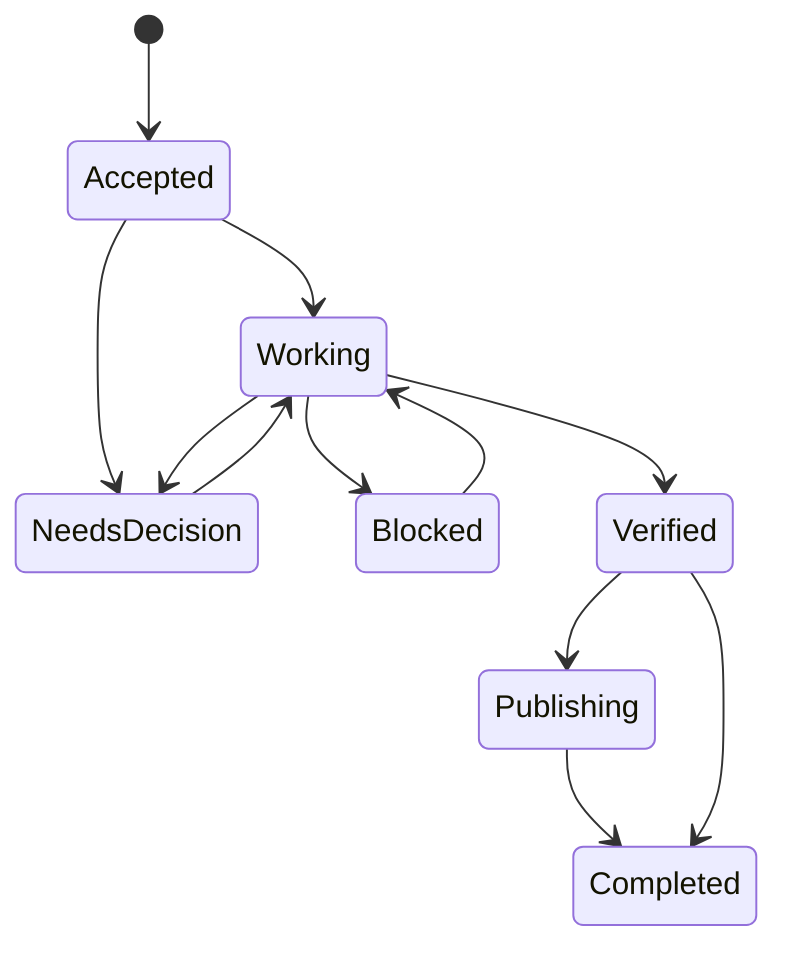

# PLAN: единый пользовательский вход great_cto

**Status:** in progress, first increment implemented in source, not released
**Date:** 2026-10-02
**Owner:** great_cto maintainers
**Tracking:** Beads epic `great_cto-3ae3`; execution status lives in Beads.

## Цель и границы

Пользователь описывает результат, видит прогресс и принимает существенные
решения. Выбор команды, агента и последовательности проверок выполняется внутри.
Основная поверхность: `run`, `status`, `resume`. Расширенные команды сохраняются
для совместимости и диагностики. Упрощение интерфейса не меняет разрешения на
production, внешнюю публикацию, расходы или перезапись данных.

Исходный локальный checkout до обновления базы: 44 команды и 70 файлов агентов. После rebase сохранены новые upstream audit/resume protocols и переименования команд. README
допускал `/start` для фичи, а реализация команды останавливала существующий проект.
Основной skill сопоставлял «full auto» с `gates-only`. Справка обещала один гейт,
хотя реальное правило вычислялось из approval-level и обязательных overrides.

Поддерживаемые границы хостов: [HOST-CODEX](../HOST-CODEX.md). Расширенные
команды сохраняются в [справочнике](../COMMANDS.md).

## Архитектурные решения

Единый вход реализуется адаптерами существующих хостов. Claude Code запускается
интерактивно с `/start`, `/inbox` или `/resume`, загруженным плагином и штатными
разрешениями. Для Codex используется существующий контроллер, его verifier,
write allowlist, lock и хранилище вне рабочего каталога. Новый дублирующий state
store на первом этапе не вводится.

В первом инкременте host задаётся явно через `--host`; по умолчанию Claude Code.
Это не эмуляция Claude hooks внутри Codex. Контролируемый Codex run по-прежнему
требует явный `--allow`. Автоматический выбор run разрешён только при одном
незавершённом запуске в текущем проекте. UUID не используется как дата создания.
Нечитаемое состояние блокирует выбор. Resume не approve, не recover и не ship.

Для нового Codex проекта entry остаётся product-owner; существующий настроенный
проект входит через architect. Семантический fast path и отдельный research
outcome для controller будут проектироваться вместе с общим task contract:
ключевое слово «fix» не является доказательством низкого риска.

## Последовательность и зависимости

`great_cto-3ae3.1`: первый поставляемый инкремент. CLI `run/status/resume`,
универсальный chat `/start`, продолжение без повторного «go», согласованная
основная справка и примеры. Проверки охватывают аргументы, ошибки запуска,
состояние разных проектов, неоднозначность, ожидание гейтов и отсутствие
shell-интерполяции. Существующие команды остаются работоспособными.

`great_cto-3ae3.2` зависит от первого инкремента: главный экран задачи и карточки
решений. Карточка содержит рекомендацию, альтернативу, последствия и причину
вмешательства. Детали агентов доступны вторым уровнем. Отсутствующий QA verdict
не отображается как успех. Привязка одобрения к версии предложения должна
использовать существующие runtime receipts, а не только текст карточки.

`great_cto-3ae3.3` зависит от первого инкремента: общий durable task contract
для Claude verdict state и controlled runtime state. Для board второго этапа
нужна стабильная проекция; backend нормализации можно разрабатывать до UI.
Данные включают goal, acceptance, authority, budget, stage, evidence и pending
decisions. Host adapters преобразуют свой state в проекцию; один компонент
остаётся владельцем переходов и разрешений.

После появления измерений политика сокращает технические остановки и лишние
вызовы агентов. Обязательные проверки остаются автоматическими условиями
перехода. Новое действие, выходящее за согласованную authority, создаёт решение.
Регулируемые операции и изменение модели доступа требуют анализа последствий,
даже когда diff мал.

## Целевая машина состояний

Это целевой общий контракт, а не новая реализованная state machine первого
инкремента. `Verified` требует доказательств проверок. `Completed` требует
запрошенного результата; deployment дополнительно требует подтверждения живой
среды. В ожидании решения состояние сохраняется, а молчание пользователя не
создаёт новое разрешение. Прежняя явно выбранная политика не переопределяется.

## Проверка результата и риски

Цели будущего UX-измерения: одна команда для начала работы; не более одной
обязательной остановки для обычной фичи в согласованной policy; продолжение
без ручного выбора стадии. Сравниваются число остановок, время до начала работы,
успешность resume и дефекты. Эти значения пока не измерены и не обещаются.

Первый этап проверяется TypeScript build, CLI unit/integration tests, структурным
валидатором, согласованностью генерируемой справки и репозиторными проверками.
Проверки CLI с fixture state не доказывают работу реальной LLM-сессии.
Сначала commit/push исходников, затем отдельный release и проверка установленного
артефакта. Работа в текущей ветке сама по себе не обновляет npm или plugin cache.

Известные ограничения первого этапа: Claude status/resume используют собственные
чат-сценарии и не объединяются с Codex JSON state; helper не создаёт общий lock
проекта поверх controller per-run lock, поэтому защита от двух одновременно
создаваемых запусков требует отдельного решения в durable task contract.

## Изменения админки

[Design handoff админки](../design/DESIGN-work-admin-2026-10.md) закрепляет
Work / Decisions / History как основные экраны, технические разделы в Tools,
различия task/run/issue/decision и независимое качество данных. Навигация и
карточки не меняют права исполнения. Read projection поставляется раньше UI;
кнопки start/resume включаются только после controlled action contract.
Текущий Beads create и GET resume не являются запуском задачи. Спецификация
подготовлена в `.5`; реализация остаётся в `.2` и `.3`.

## План реализации админки и поставленный инкремент

Последовательность: source projection → Work/History и техническая навигация →
нормализованные decision proposals → controlled host operations. В каждом этапе
backend владеет переходами, UI показывает только подтверждённые capabilities.
Отдельный frontend framework или второе хранилище workflow не требуются.

В `.6` реализованы read-only `GET /api/work`, version/revision, независимое
качество источников, явные unlinked issues и Codex runs; Work стал стартовым
экраном, History показывает terminal records, Tools содержит прежние технические
разделы. Composer готовит shell-quoted команду с явным host и Codex allowlist;
`--` отделяет текст цели от CLI options. Resume command доступна только для ready
run без active owner и pending approval. POST work отклоняется. Unknown project
не подменяется server cwd. Проекция не включает prompt, approval tokens и artifact
bytes. Проверки состояния обновляются при событиях и видимом экране; поздние
ответы другого project отбрасываются.

Это адаптер существующих источников, а не завершённый durable task contract:
`taskId=null` честно отражает отсутствие записанной связи. Claude sessions
показываются отдельно, без выдуманного goal или общего lifecycle. Статус closed
issue и done run не превращается в completed пользовательскую задачу.

Следующий этап `.3`: persisted task identity/goal/acceptance и adapter-owned links,
операции с idempotency/revision, project creation lock и host capability contract.
После него `.2` включает прямые start/resume и полноформатные decision cards.
Полная спецификация находится в [admin handoff](../design/DESIGN-work-admin-2026-10.md).
