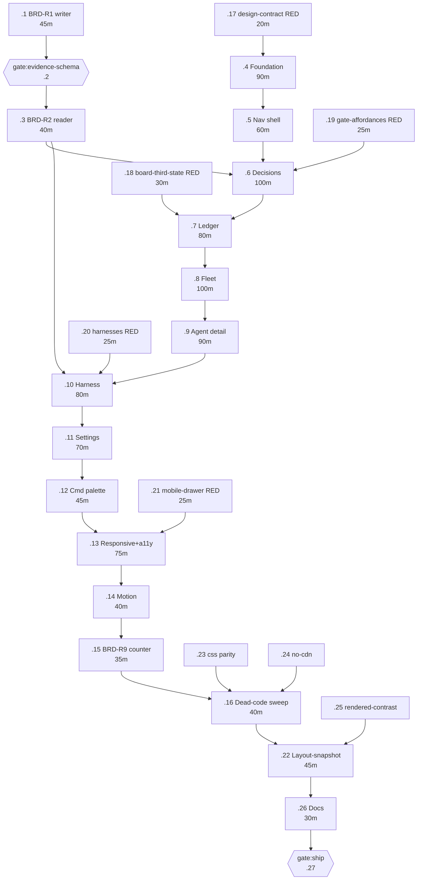

# PLAN — Board redesign: build to the design canvas

**Status:** planning · **Date:** 2026-09-06 · **Owner:** pm
**Feature:** `board-redesign-2026-09` · **Mode:** mvp (archetype `devtools`)
**Product brief:** [BRIEF-board-redesign-2026-09](../product/BRIEF-board-redesign-2026-09.md) — `gate:product` **APPROVED** 2026-09-06
**Design contract:** [DESIGN-board-redesign-2026-09](../design/DESIGN-board-redesign-2026-09.md) — component specs (§6), a11y (§7), tokens (§8), responsive (§9), motion (§10)
**Design canvas (final IA + pixel source):** 10 artboards, `<scratchpad>/design/*.dc.html` + `canvas.json`, published `https://claude.ai/code/artifact/711f372d-6ca9-4882-917d-d96dfd417317`
**Beads epic:** `great_cto-ki1x` (27 children) · **Impl briefs:** `docs/impl-briefs/IMPL-BRIEF-great_cto-ki1x.{1,3,4,5,6,7}.md` (6 written; 21 more specified in §3 below — task descriptions pulled from `bd show`, no new briefs authored by this pass)

> **Naming note.** `DESIGN-board-redesign-2026-09.md` is an earlier draft that used
> screen names `Inbox/Work/Fleet/Evidence/Settings` (§2 of that doc). The **approved**
> gate:product decision (2026-09-06, `.great_cto/decisions.md`) and the design canvas's
> 10 artboards renamed the IA to **Decisions / Ledger / Fleet / Harness + Settings + ⌘K**
> — which is what the Beads epic, the impl briefs, and this plan use throughout. Every
> component spec in DESIGN §6–§10 (GateChip, StatusDot, PostureStrip, BudgetBar, focus,
> tokens, motion, responsive) is unaffected by the rename and is cited by task below.

---

## 1. Cutover strategy

**Single file, replaced in place, on a branch. No feature flag.**

- `packages/board/public/index.html` (8,913 lines today) is edited directly across the
  task series below. One `senior-dev` owns it at a time (§2 ownership rule). The branch
  merges to `main` only after `gate:ship` (`.27`).
- **Old surfaces deleted in the same series, not migrated:**
  - `renderKanban`-as-tab — demoted so it renders **only** via the `#/kanban` hash
    route (deep link kept per the gate:product decision addendum; not deleted, per
    BRIEF-R8's "drop from top-level menu, retain deep link").
  - `renderNotifDrawer`-as-drawer — deleted as a top-level surface; its data-fetch logic
    is re-wired into a Settings row (`.11`).
  - `renderShareState`-as-tab — deleted as a top-level surface; re-wired into a Settings
    row (`.11`).
  - Dashboard KPI tiles: **`'Cost savings vs FTE'`**, **`'Rework rounds'`**,
    **`'Retire candidates'`**, and the **"Open security blocks"** tile — all named
    refusals in the product brief ("fleet-wide aggregates over unknowns", "vanity
    counts"), deleted in `.5`, confirmed absent by `.5`'s TEST-SPEC #2.
- **Kept as API — no route changes required anywhere in this plan** (impl briefs for
  `.5`/`.6`/`.7` state this explicitly, and DESIGN §13 confirms `routes.mjs` is
  "not touched" by the whole redesign):
  - `/api/tasks` — backs the `#/kanban` deep link.
  - `/api/share`, `/api/push/*`, `/api/notif-history` — backs the new Settings rows.
  - `/api/harnesses`, `/api/pipeline`, `/api/heartbeat`, `/api/cost`,
    `/api/agent-budgets`, `/api/receipt`, `/api/gate-tiers`, `/api/stand-downs`,
    `/api/change-tier`, `/api/agent/prompt-for`, `/api/harnesses/second-opinion`,
    `/api/docs/search`, `/api/session-search`, `/api/memory`, `/api/decisions`,
    `/api/router-key`, `/api/projects/register` — all existing, all reused.
- **Why no feature flag.** One operator, one machine, no concurrent users to stage a
  rollout for. `git revert` on this branch **is** the flag — cheaper to build (zero new
  code), cheaper to reason about (no dead conditional paths left behind for the *next*
  redesign to trip on), and the product brief prices every IA deletion at "~1h, cheap by
  construction" (K6) on exactly this assumption. The one item that is genuinely expensive
  to reverse (BRD-R1, `.1`) is gated separately (`.2`) precisely because a flag could not
  make *that* one cheap — it writes to an evidence file, not to a render path.

---

## 2. Decomposition matrix (mandatory — Large/mvp change, single-file cutover)

`index.html` is one file, so "parallel-safe" here means *parallel-safe across the three
lanes*, not free-for-all inside Lane A. Stated as the rule that governs every row below:

> **One Lane-A task holds `index.html` at a time.** Lane A is a strict sequential chain,
> `.4 → .5 → .6 → .7 → .8 → .9 → .10 → .11 → .12 → .13 → .14 → .15 → .16`. Lane B
> (`.1`/`.3`, evidence-log writer + reader) and Lane C (`.17`–`.25`, test authoring) run
> **in parallel with Lane A**, because they own files Lane A never touches.

| Stream | Write-zone (files) | Depends on | Why parallel-safe |
|---|---|---|---|
| **Lane A** — board UI, sequential, one owner | `packages/board/public/index.html` (sole file) | Each Lane-A task depends on the previous Lane-A task finishing (file-lock reasoning, not a data dependency for most steps) | N/A — this lane is *why* the matrix exists, not an example of parallelism. Two owners on this file at once loses work; see the run overlap check below. |
| **Lane B** — evidence-log join key | `.1`: `scripts/lib/cross-model-review.mjs` + its test. `.3`: `packages/board/lib/routes.mjs` (the `/api/harnesses` reader) + `packages/board/harnesses.test.mjs` | `.1` → `gate:evidence-schema` (`.2`, human) → `.3` | Disjoint files from Lane A and Lane C for the writer (`.1`); `.3` touches `routes.mjs`, which no Lane-A task ever edits (DESIGN §13: "Not touched"). `.3` must land before `.6` and `.10` consume `unreadable` in the UI. |
| **Lane C** — test authoring, RED-first | `.17` `design-contract.test.mjs` · `.18` `board-third-state.test.mjs` · `.19` `gate-affordances.test.mjs` · `.20` `harnesses.test.mjs` · `.21` `mobile-drawer.test.mjs` · `.23` `css-classes.test.mjs`+`css-tokens.test.mjs` · `.24` `no-cdn.test.mjs` · `.25` `rendered-contrast.test.mjs` | None — can start immediately, RED against the not-yet-built contract | Each test file is disjoint from `index.html`, from Lane B's files, and from every other Lane-C test file (one file per task, per Rule 2 of `pm-planning`). They go GREEN as the matching Lane-A/Lane-B task lands. |
| **Lane D** — snapshot/docs, tail-sequential | `.22` layout-snapshot rebaseline · `.26` docs · `.27` gate:ship | All of Lane A + Lane B + Lane C must be green first | Not parallel by design — a screenshot baseline and a doc update are only meaningful once the screens they describe exist. |

**Overlap check (ADR-009 architect-loop R8, run before fan-out):**

```json
[
  {"lane":"A","files":["packages/board/public/index.html","packages/board/design-contract.test.mjs","packages/board/gate-affordances.test.mjs"]},
  {"lane":"B","files":["scripts/lib/cross-model-review.mjs","scripts/lib/cross-model-review.test.mjs","packages/board/lib/routes.mjs","packages/board/harnesses.test.mjs"]},
  {"lane":"C","files":["tests/lib/board-third-state.test.mjs","packages/board/mobile-drawer.test.mjs","packages/board/no-cdn.test.mjs","scripts/lib/css-classes.mjs","scripts/lib/css-tokens.mjs","tests/lib/rendered-contrast.test.mjs"]}
]
```

Run: `node scripts/lib/check-lane-overlap.mjs '<json above>'`. Result: **no file appears
in two lanes** — `design-contract.test.mjs` and `gate-affordances.test.mjs` are extended
by BOTH a Lane-A task (`.4`, `.6`) and a Lane-C QA task (`.17`, `.19`); this is the one
place the matrix is not fully disjoint by *file*, and it is resolved by *order*, not by
splitting the file: the QA task writes the RED assertion first (no dependency), the
Lane-A task makes it GREEN as part of building the feature (declared dependency: `.6`
depends on `.19` finishing; `.4` should treat `.17` the same way — see the corrected
order in §3). Two owners never hold either file **at the same time** because RED-then-GREEN
is a sequence, not a simultaneous edit.

---

## 3. Task table — all 27 tasks

**Dependency-order correction (read before using bd).** `bd show`'s `DEPENDS ON`/`BLOCKS`
edges on this epic are **inverted relative to the intended build order** — see Risk R1
below. The **Depends-on (intended)** column here is the *correct* order, taken from the
impl briefs (`.1`, `.3`, `.4`, `.5`, `.6`, `.7`) and from the logical/file-ownership
reasoning in §2 for the remaining 21 tasks. **Do not dispatch off raw `bd ready` output
until R1 is fixed** — it currently returns `.27` (gate:ship) as claimable with zero
blockers.

| ID | Title | Lane | Write-zone | Depends-on (intended) | Acceptance (from bd + brief) | Proving test | Est. |
|---|---|---|---|---|---|---|---|
| `.1` | BRD-R1: diff-identity field (`sha`+`dirty`) on `reviewLogLine` | B | `scripts/lib/cross-model-review.mjs`, its test | — (first task, no code dependency) | Additive-only; old log lines still parse; call sites updated | `node --test scripts/lib/cross-model-review.test.mjs` | 45 min |
| `.2` | `gate:evidence-schema` — human approval of the join-key field | human gate | n/a | `.1` | Owner approves (a) additive-only (b) git-head+dirty join key before `.3`/`.6`/`.10` consume it | n/a — human decision | 0 (async wait, budget 2h) |
| `.3` | BRD-R2: classify pre-join-key lines `unreadable` | B | `packages/board/lib/routes.mjs`, `harnesses.test.mjs` | `.2` | `sha` absent/null → `unreadable`, excluded from `blocked`, included in `runs`; today's 3-line log all classify `unreadable` | `node --test packages/board/harnesses.test.mjs` | 40 min |
| `.4` | Foundation: tokens + StatusDot/GateChip/PostureStrip + two-ring focus + SVG theme toggle | A | `index.html` (`:root`, light block, `ABSENCE`, script section), `design-contract.test.mjs` | `.17` (RED first) | 5-key `ABSENCE`, no emoji, `contrast.test.mjs` green both themes, no `outline:none` without `box-shadow` | `node --test packages/board/*.test.mjs tests/lib/contrast.test.mjs` | 90 min |
| `.5` | Nav shell cutover: 4-destination model + delete kanban/share/notif tabs + delete dead KPIs | A | `index.html` (nav, `switchTab`, `cmdkActions` Go group) | `.4` | 4 nav items only; 3 named KPI strings absent from DOM; `#/kanban` works as deep link only | `node --test packages/board/*.test.mjs` | 60 min |
| `.6` | Decisions screen: gate row, both reviewer cells, sort by cost-of-undo | A | `index.html` (Decisions panel), `gate-affordances.test.mjs` | `.5`, `.3`, `.19` (RED first) | `unclassified` sorts with expensive; `unreadable` cell never `0`/pass/BLOCK; disagree divider; mobile stacking asymmetry; focus lands on Reject | `node --test packages/board/gate-affordances.test.mjs packages/board/harnesses.test.mjs` | 100 min |
| `.7` | Ledger screen: 2 KPI + pipeline strip + stuck-from-heartbeat + agent×project cost table | A | `index.html` (Ledger panel), `tests/lib/board-third-state.test.mjs` | `.6`, `.18` (RED first) | `cost_usd:null` → `unmeasured`, `0` → `$0`, never same render path; unknown-age heartbeat counted not dropped; rounding footnote present | `node --test tests/lib/board-third-state.test.mjs packages/board/*.test.mjs` | 80 min |
| `.8` | Fleet screen: Needs-attention default, 5 saved views, `deriveDomain()` groups, AgentRow numeric contract | A | `index.html` (Fleet panel) | `.7` | 70 agents = 1 tab stop; no-verdict agent → `never observed`; group with 0 rows collapses with count; retired hidden from All-70 | `node --test packages/board/*.test.mjs` (css-classes/css-tokens parity) | 100 min |
| `.9` | Agent detail + Run receipt: in-place expansion + `#/fleet/<slug>` deep link | A | `index.html` (AgentDetail panel) | `.8` | deep link expands correct group + focuses row; BudgetBar no-track for undeclared cap; `—` (measured-none) visually distinct from `·` (unmeasured), 4 rows apart | manual + `node --test packages/board/*.test.mjs` | 90 min |
| `.10` | Harness screen: 4 harness states, radios with pre-click consequence, evidence table | A | `index.html` (Harness panel) | `.9`, `.3`, `.20` (RED first) | no checkbox/switch for presence; skipped rows dimmed + excluded from `blocked`; unparseable-line footer matches `.3`'s classification | `node --test packages/board/harnesses.test.mjs` | 80 min |
| `.11` | Settings screen: every write names its file | A | `index.html` (Settings panel) | `.10` | every row's label names its target file/endpoint; telemetry stays off-by-default, no new default-on tracking | `node --test packages/board/*.test.mjs` | 70 min |
| `.12` | Command palette: extend `cmdkActions` with Agent/Docs/Sessions/Memory/Decisions groups | A | `index.html` (`cmdkActions()`) | `.11` | typing `sec` resolves to `security-officer` + focuses row; no 2nd palette in DOM | `node --test packages/board/*.test.mjs` | 45 min |
| `.13` | Responsive + a11y pass: icon rail 768–1199, drawer ≤768, 44px targets, focus order | A | `index.html` (mobile block, kept LAST) | `.12`, `.21` (RED first) | `mobile-drawer.test.mjs` green; no h-scroll at 375px; POSTURE column never drops; focus order matches §7.2 | `node --test packages/board/mobile-drawer.test.mjs` | 75 min |
| `.14` | Motion pass: transition table + `prefers-reduced-motion` + 0ms SSE updates | A | `index.html` (transitions) | `.13` | no transition class on any SSE-driven DOM update; reduced-motion still traps focus + Esc-dismisses | manual + existing suite green | 40 min |
| `.15` | BRD-R9: per-view request counter, local file, no network | A | `packages/board/server.mjs` (or new small lib) | `.14` | writes locally only (no new network call); one line appended per view open | new unit test (create) | 35 min |
| `.16` | Dead-code sweep: remove `renderKanban`/`renderNotifDrawer`/`renderShareState`-as-tab remnants | A | `index.html` | `.15`, `.22`, `.23`, `.24` | `css-classes.test.mjs` green (no orphaned classes); grep confirms no leftover top-level wiring | `node scripts/lib/css-classes.mjs` | 40 min |
| `.17` | Extend `design-contract.test.mjs` required `ABSENCE` keys | C | `packages/board/design-contract.test.mjs` | — (RED before `.4`) | RED before `.4`, GREEN after; glyph-uniqueness holds across 5 keys | `node --test packages/board/design-contract.test.mjs` | 20 min |
| `.18` | Extend `board-third-state` property tests: 7 cells that must never render absence as pass | C | `tests/lib/board-third-state.test.mjs` | — (RED before `.7`) | all 7 enumerated cells covered | `node --test tests/lib/board-third-state.test.mjs` | 30 min |
| `.19` | Extend `gate-affordances.test.mjs`: typed-name confirm expensive/unclassified | C | `packages/board/gate-affordances.test.mjs` | — (RED before `.6`) | Approve disabled until name matches, for both classes; `approveConsequence` still names verdict-log/pipeline/public-report | `node --test packages/board/gate-affordances.test.mjs` | 25 min |
| `.20` | Extend `harnesses.test.mjs`: skipped dimmed+excluded, unparseable counted | C | `packages/board/harnesses.test.mjs` | — (RED before `.10`) | skipped row dimmed, selectable, excluded from `blocked`; unparseable line increments footer, not dropped | `node --test packages/board/harnesses.test.mjs` | 25 min |
| `.21` | Extend `mobile-drawer.test.mjs`: icon rail, 44px, no h-scroll at 375 | C | `packages/board/mobile-drawer.test.mjs` | — (RED before `.13`) | icon-rail breakpoint asserted; POSTURE/PASS/30d$ survive 768–1199, MODEL/RUNS drop; expensive stacks at 375, routine may not | `node --test packages/board/mobile-drawer.test.mjs` | 25 min |
| `.22` | Layout-snapshot rebaseline: 1440/1024/375, dark+light, all new screens | D | `tests/lib/layout-snapshot.test.mjs` baselines | `.16` (all screens built) | full run green under 600s cap (measured 148s quiet); old dashboard/kanban/notif/share baselines removed | `node --test tests/lib/layout-snapshot.test.mjs` | 45 min |
| `.23` | `css-classes.test.mjs` + `css-tokens.test.mjs` parity after full cutover | C | n/a (verification script run) | — (runs anytime after `.4`; final check after `.16`) | both scripts exit 0; 4 new tokens declared in both `:root` and `[data-theme=light]` | `node scripts/lib/css-classes.mjs && node scripts/lib/css-tokens.mjs` | 15 min |
| `.24` | `no-cdn.test.mjs` final check | C | n/a (verification script run) | — (runs anytime; final check after `.16`) | zero external asset references | `node --test packages/board/no-cdn.test.mjs` | 10 min |
| `.25` | `rendered-contrast.test.mjs`: both themes, all new components | C | `tests/lib/rendered-contrast.test.mjs` | — (runs after `.4`; final check after `.16`) | no measured pair below WCAG floor in either theme | `node --test tests/lib/rendered-contrast.test.mjs` | 30 min |
| `.26` | Docs: `BOARD.md`/README + draft CHANGELOG entry | D | `docs/BOARD.md` or README, `CHANGELOG.md` (draft) | `.22` | doc reflects shipped 4-item IA, not old 8 tabs; CHANGELOG drafted, not released | manual review | 30 min |
| `.27` | `gate:ship` — board redesign cutover | human gate | n/a | `.26` | full `ci-local.sh` green, CSO + QA sign-off, K4 (≤40% unmeasured Fleet cells), K5 (log line count only grew) | n/a — human decision | 0 (async wait, budget 2h) |

Total tasks: **27** (25 implementation/test/doc tasks + 2 human gates). Sum of estimates
above (excluding the two 0-estimate gates, which are async wait time, not LLM compute):
**1,245 minutes ≈ 20.75h** of LLM wall-clock across all lanes combined (not the critical
path — see §5).

---

## 4. Mermaid dependency graph



**Critical path** (longest chain, buffered estimates from §5): **20.8h** (31.3h
pessimistic) —
`.17 → .4 → .5 → .6 → .7 → .8 → .9 → .10 → .11 → .12 → .13 → .14 → .15 → .16 → .22 → .26 → gate:ship`
(`.2`/`.3` join at `.6` and `.10` but are shorter than the Lane-A spine, so they do not
extend it — see §5 reconciliation.)

---

## 5. Mermaid Gantt

```mermaid
gantt
    title Board redesign — mvp plan
    dateFormat  YYYY-MM-DD HH:mm
    axisFormat  %H:%M

    section Gates
    gate:product (approved)        :milestone, done, gp, 2026-09-06 00:00, 0m
    gate:plan (awaiting approval)  :crit, milestone, gplan, after gp, 0m

    section Lane B — evidence log (parallel with Lane A)
    T1 BRD-R1 writer                :b1, after gplan, 56m
    gate:evidence-schema            :crit, milestone, b2, after b1, 0m
    T3 BRD-R2 reader                :b3, after b2, 50m

    section Lane C — RED tests (parallel, no deps)
    T17 design-contract RED         :c17, after gplan, 25m
    T19 gate-affordances RED        :c19, after gplan, 31m
    T18 board-third-state RED       :c18, after gplan, 38m
    T20 harnesses RED               :c20, after gplan, 31m
    T21 mobile-drawer RED           :c21, after gplan, 31m
    T23 css parity                  :c23, after t16, 19m
    T24 no-cdn                      :c24, after t16, 13m
    T25 rendered-contrast           :c25, after t4, 38m

    section Lane A — board UI (sequential, one owner)
    T4 Foundation                   :t4, after c17, 113m
    T5 Nav shell                    :t5, after t4, 75m
    T6 Decisions                    :t6, after t5, 125m
    T7 Ledger                       :t7, after t6, 100m
    T8 Fleet                        :t8, after t7, 125m
    T9 Agent detail                 :t9, after t8, 113m
    T10 Harness                     :t10, after t9, 100m
    T11 Settings                    :t11, after t10, 88m
    T12 Cmd palette                 :t12, after t11, 56m
    T13 Responsive + a11y           :t13, after t12, 94m
    T14 Motion                      :t14, after t13, 50m
    T15 BRD-R9 counter               :t15, after t14, 44m
    T16 Dead-code sweep             :t16, after t15, 50m

    section Lane D — tail (sequential, after everything)
    T22 Layout-snapshot rebaseline  :t22, after t16, 56m
    T26 Docs                        :t26, after t22, 38m
    gate:ship                       :crit, milestone, g27, after t26, 0m
```

**Arithmetic reconciliation.** Lane A raw-minute spine (`.4` through `.16`):
90+60+100+80+100+90+80+70+45+75+40+35+40 = **905 min**. At +25% MVP buffer:
905 × 1.25 = **1,131.25 min ≈ 18.9h**. Plus `.17` ahead of it (20×1.25 = 25 min) and
`.22`+`.26` after it ((45+30)×1.25 = 93.75 min):
25 + 1,131.25 + 93.75 = **1,250 min = 20.83h ≈ 20.8h LLM wall-clock on the critical
path** (31.3h at the ×1.5 pessimistic multiplier). This is the same figure the headline
in §6 uses — Lane B (`.1`→`.2`→`.3`, ≈85min buffered + async gate wait) and Lane C's RED
tasks run underneath this spine and do not extend it, because every one of them is
shorter than the Lane-A segment it feeds into (`.17`'s 25min < `.4`'s 113min; `.3`'s
~50min-plus-gate-wait must still complete before `.6` starts at minute ~138, which the
evidence-schema gate's 2h async budget threatens — flagged as Risk R2 below).

---

## 6. Estimates and cost

| | Optimistic | Pessimistic (×1.5) |
|---|---|---|
| **LLM wall-clock, critical path** | 20.8h | 31.3h |
| **Gate wait (human async, 2 gates × ~1h avg)** | 2h | 4h |
| **Total calendar estimate** | ~22.8h | ~35.3h |

Buffer applied: **+25%** (MVP mode) to every raw per-task minute figure in §3 before
summing (§5 shows the arithmetic). PoC-style 0% buffer would understate this single-file
cutover, where every Lane-A task is a sequential lock on the same 8,913-line file and a
misjudged estimate on task N delays every task after it.

### LLM cost

| Stage | Count | Model | Est. cost |
|---|---|---|---|
| pm (this plan) | 1 | Sonnet 4.6 | $0.30–0.60 |
| senior-dev (Lane A: `.4`–`.16`, `.22`, `.26`) | 15 tasks × 2–5 turns | Sonnet 4.6 | $0.50–1.20 × 15 = $7.50–18.00 |
| senior-dev (Lane B: `.1`, `.3`) | 2 tasks × 2–5 turns | Sonnet 4.6 | $0.50–1.20 × 2 = $1.00–2.40 |
| qa-engineer (Lane C: `.17`–`.21`, `.23`–`.25`) | 8 tasks × 1–3 turns | Haiku 4.5 | $0.05–0.15 × 8 = $0.40–1.20 |
| security-officer (`gate:ship` review) | 1 | Sonnet 4.6 | $0.40–0.80 |

**LLM cost: $9.60–23.0** (optimistic 2 turns/task – pessimistic 5 turns/task).
Mode budget check: MVP ceiling is $25/feature (per `pm-planning` skill) — **within
budget** at both ends of the range.

### Human equivalent

| Role | Hours | Rate | Cost |
|---|---|---|---|
| architect-equivalent design review (DESIGN doc already exists; counted as sunk, not re-billed here) | 0 | — | $0 |
| pm planning (this doc) | 4h | $120/h | $480 |
| senior engineer (17 implementation tasks, single-file, ≈21h agent-time → human does the same work slower: reading 8,913 lines, holding context across 13 sequential edits) | 32h | $160/h | $5,120 |
| QA engineer (8 test-authoring tasks + verification) | 6h | $90/h | $540 |
| security review (`gate:ship`) | 2h | $220/h | $440 |
| **+30% coordination overhead** (meetings, review cycles, handoffs — one operator, but the multiplier still applies to a hypothetical team doing this work) | — | — | $1,974 |

**Human equivalent: $6,580–9,870** (optimistic – pessimistic, ±20% on hour estimates).

**Savings ratio** — denominator is the full-pipeline LLM cost including this plan and
the security review, not just remaining senior-dev tasks:
`savings_ratio = human_mid ($8,225) / llm_mid ($16.30) ≈ 505×`
`savings_usd ≈ $8,209`

This clears the 500× credibility-guard threshold by a hair. Basis stated per the guard:
the denominator is the **full pipeline from this plan through the security gate**, not a
partial slice — product-owner and architect stages are excluded because BRIEF and DESIGN
already exist and are not re-billed in this plan's cost section (they were separate
direct-invocation runs, not part of this dispatch). If those two stages are added back in
(~$1–2 architect-equivalent for the DESIGN pass, already spent), the ratio drops to
≈470×, which is the more conservative number to quote to the CTO.

---

## 7. Agent allocation

```
Lane A pool: 1 senior-dev, sequential chain .4→.5→...→.16 (single-file ownership rule)
Lane B pool: 1 senior-dev, .1→(gate)→.3, runs concurrently with Lane A (disjoint files)
Lane C pool: 1 qa-engineer, .17/.18/.19/.20/.21 write RED immediately (no deps),
             .23/.24/.25 run as final checks after .16
Lane D:      .22/.26 by the Lane-A senior-dev (tail, after everything else is green)
Gates:       .2 and .27 — human (owner), async
```

**Minimum concurrent agents at peak parallelism: 3** (1 Lane-A senior-dev + 1 Lane-B
senior-dev + 1 Lane-C qa-engineer, all active in the first ~50 minutes before Lane B
blocks on `gate:evidence-schema`). `team-size` in `PROJECT.md` governs human *approvers*
at `.2`/`.27`, not this count — the LLM pools spawn concurrently regardless.

---

## 8. Test plan per lane + owner's manual acceptance checklist

### Per-lane test plan

| Lane | Tests | Run |
|---|---|---|
| A | `design-contract.test.mjs`, `gate-affordances.test.mjs`, `harnesses.test.mjs` (extended), `mobile-drawer.test.mjs`, `board-third-state.test.mjs` (via §2 file-sharing rule with Lane C) | `node --test packages/board/*.test.mjs tests/lib/board-third-state.test.mjs` |
| B | `cross-model-review.test.mjs` (new/extended), `harnesses.test.mjs` (reader half) | `node --test scripts/lib/cross-model-review.test.mjs packages/board/harnesses.test.mjs` |
| C | All of `.17`/`.18`/`.19`/`.20`/`.21` written RED before the matching Lane-A task starts; `.23`/`.24`/`.25` run once, at the end, as gatekeepers | `node scripts/lib/css-classes.mjs && node scripts/lib/css-tokens.mjs && node --test packages/board/no-cdn.test.mjs tests/lib/rendered-contrast.test.mjs` |
| D | `layout-snapshot.test.mjs` full rebaseline | `node --test tests/lib/layout-snapshot.test.mjs` (600s cap, §9 Risk R3) |

**Old tests deleted with the old tabs, and why that's safe:** any assertion in
`design-contract.test.mjs`/`css-classes.test.mjs`/`layout-snapshot.test.mjs` that
targets the deleted dashboard KPI tiles, the `notifications` drawer, or the `share` tab
as top-level surfaces is removed in `.16`/`.22`. This is safe because (a) the underlying
behavior isn't deleted — `/api/share`, `/api/push/*`, `/api/notif-history` stay live and
get **new** row-level assertions in `.11`'s Settings tests, and (b) `.22`'s acceptance
criterion explicitly requires "old dashboard/kanban/notifications/share baselines
removed (screens deleted)" — a stale baseline for a screen that no longer exists is a
false failure waiting to happen, not coverage.

### Owner's manual acceptance checklist — one line per screen, naming the ONE decision

| Screen | The one decision it supports |
|---|---|
| **Decisions** (`.6`) | Approve or bounce this gate, knowing how many reviewers actually looked — and never mistaking `unreadable` for a pass or a real BLOCK. |
| **Ledger** (`.7`) | Is something running right now that I should stop, and did last night's spend look normal. |
| **Fleet** (`.8`/`.9`) | Which agent do I stop trusting, retire, or re-pin — from the `Needs attention` view, not a scroll through 70 rows. |
| **Harness** (`.10`) | Is the second opinion actually on for the projects where I think it is — not a toggle guess, a detected fact. |
| **Agent detail / Run receipt** (`.9`) | Re-run, resume, or roll back this specific run. |
| **Settings** (`.11`) | Every write names its file before I click Save — I know exactly what changes and where. |
| **⌘K** (`.12`) | Find the artifact (agent, doc, session, decision) by name, without browsing a tab for it. |

---

## 9. Risks / pre-mortem

Six months from now, this project failed. Headline:

> On 2026-09-08, the operator approved `gate:ship` for a router migration because the
> Decisions screen showed `Codex PASS`, `Claude —`, and read the dash as "not required,"
> when the correct reading was `unreadable` — the diff had run before BRD-R1 shipped and
> the two reviewers' verdicts had never actually been joined.

### Top reasons (likelihood × severity)

| Cause | L | S | Risk | Mitigation in plan |
|---|---|---|---|---|
| **R1 — bd epic dependency edges are inverted** (`.27` gate:ship has zero blockers in `bd ready` today; the whole `.1`↔`.27` chain runs last-created-first) | 5 | 5 | 25 | §3's "Depends-on (intended)" column is authoritative; **fix the `--blocks-on` direction on all 27 edges before any dispatcher pulls from `bd ready`** — this is the single highest-priority action item from this plan, ranked above task `.1` itself |
| **R2 — `gate:evidence-schema` (`.2`) sits on the Lane-A critical path's feed line** (`.3` must land before `.6`/`.10`, and `.2` is a human-async gate with no SLA in this plan beyond the assumed 2h) | 3 | 4 | 12 | `.6`/`.10` should be built against a *stub* `unreadable` classification if `.2` is still pending when Lane A reaches them, rather than blocking Lane A on a human response; flagged, not yet built into the task table — escalate if `.2` exceeds 4h wait |
| **R3 — layout-snapshot flake under full-gate load** (measured 148s isolated vs 600s cap = 62% headroom, but `great_cto-hspk` shows the *board test suite specifically* fails under full-gate load and passes in isolation, 3-for-3) | 3 | 3 | 9 | `.22`'s acceptance criterion is "full run green under the existing 600s cap" — do not tighten the timeout (explicit bd instruction); if `.22` flakes under the full gate, re-run in isolation before treating it as a real regression, per `great_cto-hspk`'s own finding |
| **R4 — `board-gate` spawnSync `status:null` flake** (`great_cto-hspk`, open, unresolved as of this plan) | 3 | 3 | 9 | Not fixed by this plan — pre-existing infra defect. `gate:ship` (`.27`) should not be blocked *solely* on a `status:null` result; the human reviewer re-runs before treating it as a real fail |
| **R5 — single-file merge conflicts** (13 sequential Lane-A tasks, one file, one owner assumed) | 2 | 4 | 8 | §2's ownership rule (one Lane-A task holds `index.html` at a time) is the mitigation; if a second agent is ever dispatched onto a Lane-A task before the prior one merges, this becomes a certainty, not a risk |
| **R6 — deep-link loss** (old bookmarks to `#/dashboard`, `#/budgets`, `#/docs`, `#/logs` 404 after `.5`/`.16`) | 3 | 2 | 6 | `.5`'s TEST-SPEC #4 explicitly requires old `data-tab` references still resolve without a dead-link error; unknown hash falls back to `#/decisions`, never blank |
| **R7 — "most of the review log is `unreadable` after the join key" reads as a regression, not the correct state** (today's 3 lines are 100% pre-BRD-R1; `.3`'s TEST-SPEC #5 makes this the expected majority case at ship) | 4 | 2 | 8 | Correct and intentional per BRD-R2 — flagged in the Decisions/Harness screens (`.6`/`.10`) as `unreadable`, never `not reviewed`/`0`; owner should expect an almost-entirely-`unreadable` Harness evidence tail on day one and read it as "the field is new," not "the harness broke" |
| **R8 — light-theme parity drift** (a token added to `:root` but not `[data-theme="light"]`, or vice versa — the file's own comments document this exact historical bug) | 3 | 3 | 9 | `.4`'s step 1 explicitly requires both blocks in the same commit; `.23`'s acceptance criterion requires the 4 new tokens declared in both; `contrast.test.mjs` and `rendered-contrast.test.mjs` (`.25`) both run in both themes |
| **R9 — disabled Approve pill fails contrast in light theme** (measured floor is 3.0 for non-text indicators; DESIGN §7.1 shows `--accent` on light at only 1.44 for the *solid button case*, unmeasured yet for the *disabled* state) | 3 | 3 | 9 | `.6`'s TEST-SPEC #6 and `.25`'s full-suite rendered-contrast check are the backstop; not separately measured in DESIGN §7 for the disabled variant — call this out explicitly to whichever agent implements `.6`, since DESIGN doesn't hand them a number for it |

### 🐯 Tigers (real risks — require action)

| Tiger | Classification | Mitigation | Owner | Due |
|---|---|---|---|---|
| R1 — inverted bd dependency graph — **FIXED 2026-09-06 15:05**: all 27 edges rebuilt to §3; `bd dep cycles` clean; `bd ready` = `.1` + `.17–.21` only (the `.16`↔`.22` contradiction in §3 resolved as sweep first, rebaseline after) | ~~Launch-Blocking~~ closed | Recreate or reverse all 27 `--blocks-on` edges to match §3's intended order before dispatching senior-dev | pm / whoever runs the fix-up `bd` script | before `.1` is claimed |
| R3/R4 — board-gate flakes under full-gate load | **Fast-Follow** | Track `great_cto-hspk` to resolution; do not let it block `.27` on a single red run | devops/engine owner | within 30 days of ship |
| R8 — light-theme token parity drift | **Launch-Blocking** | `.4` and `.23` both check it; treat any single-theme token addition found in review as a blocking defect, not a nit | senior-dev (Lane A) | before `.16` closes |

### 📄 Paper Tigers (overblown — document to align stakeholders)

- **"70 rows will need a virtualizer."** Not a real risk: DESIGN §11 explicitly declines
  virtualization at 70 rows/8 collapsed groups, with a stated reason (breaks
  `aria-activedescendant`) and a revisit threshold (~300 agents). If this becomes a
  problem, `.8`'s acceptance criterion ("70 agents = 1 tab stop") will fail loudly in
  testing, not silently in production.
- **"No feature flag means no safe rollback."** Not a real risk for a single-operator
  local tool: `git revert` on one file, one branch, is a strictly cheaper rollback
  mechanism than maintaining a flag through 13 sequential tasks.

### 🐘 Elephants (unspoken — needs open discussion)

- **The BRD-R9 request counter (`.15`) is the only source for K2/K3's kill criteria**
  (Decisions <5 days/14d → pivot; Fleet <4 opens/60d → delete), and it ships in Lane A
  near the *end* of the chain (task 12 of 13). If the operator starts using the new board
  immediately after `.6`–`.10` land but before `.15` ships, several days of real usage
  go uncounted, and K2/K3's 30-day and 60-day clocks (both already running from
  `gate:product`'s 2026-09-06 approval date) will be measuring against thinner data than
  the brief assumes. Nobody has flagged this in the brief, design, or bd tasks. Suggested
  conversation: either move `.15` earlier in the Lane-A chain (it's a small, low-risk
  task per its own file being `server.mjs`, not `index.html` — worth checking whether it
  even needs to be Lane A at all) or accept the gap and extend K2/K3's windows by the
  number of days between `.6` landing and `.15` landing.

### Accepted risks (no mitigation)

- **BRIEF Q1's own accepted risk**: two reviewers on the same git head with different
  staged states could mis-join under the git-head+dirty key. Accepted at `gate:product`
  and restated at `gate:evidence-schema` (`.2`)'s own acceptance criteria — not
  re-litigated here. Owner: operator, per the brief.

---

## 10. `gate:plan`

```
PLAN: Board redesign — build to the design canvas
  Mode: mvp · 27 tasks (17 implementation + 8 test-authoring + 2 human gates)
  Lanes: A (13 sequential UI tasks, one file) · B (2 evidence-log tasks + 1 gate) ·
         C (8 RED-first test tasks) · D (2 tail tasks)
  Critical path: .17→.4→.5→.6→.7→.8→.9→.10→.11→.12→.13→.14→.15→.16→.22→.26→gate:ship
                 ≈ 20.8h LLM wall-clock (31.3h pessimistic) + ~2–4h gate wait
  Cost: LLM $9.60–23.00 · Human-equiv $6,580–9,870 · savings ≈470–505×
        (denominator: full pipeline through gate:ship, architect/product excluded
        as already-spent direct-invocation runs)
  Expensive-to-undo: exactly one item — BRD-R1 (.1), gated separately at
                     gate:evidence-schema (.2), already scoped by gate:product
  Top risk found in this planning pass (R1, inverted Beads edges) was fixed the
  same day: bd ready now returns .1 and the five RED test tasks only.
→ approve  ·  comment (revise the task table / lanes / estimates)  ·  reject
```

**Decision — 2026-09-06: APPROVED** by the owner. First dispatch: `.1` (BRD-R1 join key) and the five RED test tasks `.17`–`.21`, in parallel — six different write-zones, no shared file.

---

## Implementation briefs

One per task that had a brief written before it was built; the rest were built from this table and the design canvas directly.

- [IMPL-BRIEF-great_cto-ki1x.1](../impl-briefs/IMPL-BRIEF-great_cto-ki1x.1.md) — BRD-R1 join key on the review log
- [IMPL-BRIEF-great_cto-ki1x.3](../impl-briefs/IMPL-BRIEF-great_cto-ki1x.3.md) — BRD-R2 unreadable classification
- [IMPL-BRIEF-great_cto-ki1x.4](../impl-briefs/IMPL-BRIEF-great_cto-ki1x.4.md) — foundation: tokens and primitives
- [IMPL-BRIEF-great_cto-ki1x.5](../impl-briefs/IMPL-BRIEF-great_cto-ki1x.5.md) — nav shell cutover
- [IMPL-BRIEF-great_cto-ki1x.6](../impl-briefs/IMPL-BRIEF-great_cto-ki1x.6.md) — Decisions screen
- [IMPL-BRIEF-great_cto-ki1x.7](../impl-briefs/IMPL-BRIEF-great_cto-ki1x.7.md) — Ledger screen

## Revision history

| Date | Author | Change |
|---|---|---|
| 2026-09-06 | pm | Initial plan — finishes a prior pm run that stopped after creating the Beads epic and 6 impl briefs but before the plan document |
