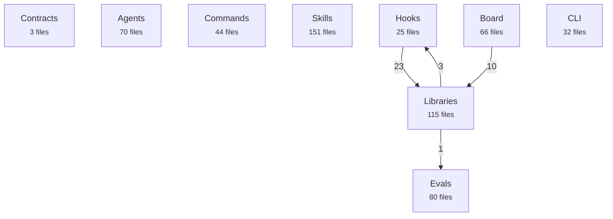
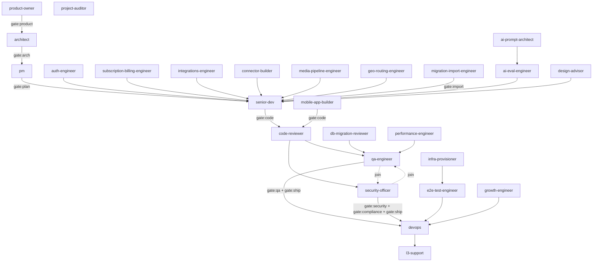

<!-- GENERATED by scripts/gen-docs-reference.mjs — do not edit by hand. -->

# Architecture maps

Both diagrams below are **derived**, not drawn: one from the import graph of
the code as it stands, the other from `shared/pipeline.toml` — the same file
the dispatcher acts on. A diagram that disagrees with the system is therefore
impossible rather than merely unlikely, and CI checks it by regenerating this
page and comparing.

There is no "generated on" date here on purpose. A date would change on every
run and make the drift check useless; the check is the freshness claim.

See also: [Agents](agents.md) · [Commands](commands.md) · [Skills](skills.md).

## How the code is arranged

Derived from what imports what, across 586 files in 9 groups.

| Group | Files | What it holds |
|---|---:|---|
| `contracts` | 3 | the pipeline map, orchestrator rules |
| `agents` | 70 | the specialists the pipeline dispatches |
| `commands` | 44 | what a human can invoke directly |
| `skills` | 151 | knowledge agents load on demand |
| `hooks` | 25 | what fires on session, tool and stop events |
| `libs` | 115 | the logic hooks and commands share |
| `board` | 66 | the admin view, zero runtime dependencies |
| `cli` | 32 | the published npm package |
| `evals` | 80 | what each agent is measured against |

## How a feature moves

Derived from `shared/pipeline.toml`. Gates are drawn because they are
where a human stands in the flow, and a map of an automated pipeline that
hides its stopping points describes something other than what runs.

