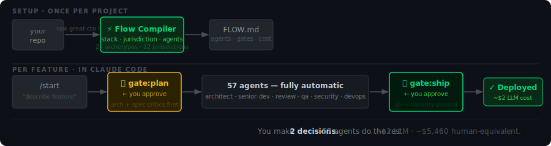

<div align="center">


**ИИ-автопилоты для бизнеса — закрывают работу целиком, а не просто пишут софт.**

[](https://www.npmjs.com/package/great-cto)
[](https://www.npmjs.com/package/great-cto)
[](../../LICENSE)
[](https://claude.com/plugins)
[](https://openai.com/codex)
[](https://greatcto.systems/proof)



```bash
npx great-cto init
```

[Сайт](https://greatcto.systems) · [Один реальный прогон →](https://greatcto.systems/proof) · [Живое демо](https://greatcto.systems/r/CsqYVXs1Vibac5yp) · [Обсуждения](https://github.com/avelikiy/great_cto/discussions) · [Журнал изменений](../../CHANGELOG.md)

Русский · [简体中文](../zh-CN/README.md) · [繁體中文](../zh-TW/README.md) · [日本語](../ja/README.md) · [한국어](../ko/README.md) · [Español](../es/README.md) · [Português](../pt-BR/README.md) · [Deutsch](../de/README.md) · [Français](../fr/README.md)

</div>

---

## Сервисы — это новый софт

Следующая волна — это не инструменты для специалистов, а **автопилоты, которые продают результат сервиса**.
Автопилот выполняет целую бизнес-функцию от начала до конца (приём → обработка → решение → выдача) и
эскалирует человеку только те решения, что требуют экспертного суждения. Каждое улучшение модели делает сервис
быстрее и дешевле.

GreatCTO поставляет такие автопилоты — каждый из них представляет собой **поток (flow) из агентов и инструментов с человеком на рискованных
шагах**, встроенного ревьюера соответствия требованиям (compliance) и **живые коннекторы**, которые гоняют каждый поток на реальных данных.

## Автопилоты

| Автопилот | Что он делает | Рынок | Кто его строит |
|---|---|---|---|
| 🩺 **[Medical-coding](https://greatcto.systems/autopilots/rcm.html)** | Клинические записи → чистые, соответствующие требованиям счета; сертифицированный кодировщик подписывает рискованные | $50–80B | Anterior · CodaMetrix · Fathom |
| 🖥️ **[Managed-IT](https://greatcto.systems/autopilots/msp.html)** | Патчи, конфигурации и доступы по всему парку — поэтапно, с возможностью отката, человек на крупных изменениях | $100B+ | Serval · Edra · Electric AI |
| ⚖️ **[Legal-document](https://greatcto.systems/autopilots/legaltech.html)** | Готовит и правит договоры и NDA; лицензированный юрист подписывает всё, что является советом | $20–25B | Crosby · Harvey · Robin AI |
| 📒 **[Bookkeeping & close](https://greatcto.systems/autopilots/accounting.html)** | Ведёт учёт, сверяет и закрывает месяц; контролёр подписывает закрытие | $50–80B | Rillet · Basis · Digits |
| 🧾 **[Tax-prep](https://greatcto.systems/autopilots/tax.html)** | Готовит декларации и классифицирует позиции; аттестованный специалист подписывает перед подачей | $30–35B | Black Ore · April · Column Tax |
| 🛒 **[Source-to-pay](https://greatcto.systems/autopilots/procurement.html)** | Онбордит поставщиков, сопоставляет счета, проводит платежи — с проверкой на санкции и мошенничество | $200B+ | Tacto · Zip · AskLio |

→ [Все автопилоты](https://greatcto.systems/autopilots.html) · запустите `/flow <vertical>`, чтобы увидеть любой поток в своём терминале

**Каждый автопилот оставляет человека на решениях, требующих суждения** — сертифицированного кодировщика, лицензированного юриста,
контролёра, аттестованного специалиста. Автопилот делает объём; человек владеет решением, которое
несёт ответственность. **9 живых коннекторов работают во всех шести автопилотах** — FHIR, ICD-10 (NLM),
NCCI/MUE, X12 837P, DocuSign, Plaid, OFAC, поэтапное развёртывание (staged-rollout) и федеральный налоговый движок США. Они
по умолчанию работают без ключей (публичный источник или детерминированная реальная генерация) и отправляют POST реальному провайдеру
в тот момент, когда вы добавляете учётные данные.

## Под капотом (для CTO, который этим управляет)

Каждый автопилот строится и эксплуатируется управляемым через гейты конвейером из специализированных агентов — архитектор, ревьюер
с 12 углами зрения, QA, офицер безопасности, devops — настроенных под ваш стек и юрисдикцию. **Вы принимаете два
решения на фичу; всё остальное работает автоматически.** Ревьюер соответствия требованиям, подписанные человеком
гейты, аудит-трейл и живые коннекторы — это слой доверия, который делает безопасным предоставление автопилоту права
работать.

## В цифрах

| | |
|---|---|
| Стоимость LLM (одна реальная фича, с трассировкой) | **$2.39** |
| Эквивалент человеческого труда за ту же работу | **~$5,460** |
| Дефекты, пойманные после того, как их пропустил QA | **2** |
| Месячная стоимость (20 прогонов конвейера) | **~$34** |
| Специализированных агентов | **61** |
| Архетипов определяется автоматически | **26** |
| Юрисдикций | **12** (GDPR · HIPAA · PCI-DSS · SOX · и другие) |

→ [Полная трассировка со всеми артефактами](https://greatcto.systems/proof)

## Как это работает

**`npx great-cto init`** — сканирует ваш стек и README, определяет юрисдикцию (GDPR? HIPAA? PCI?), пишет `.great_cto/FLOW.md` с точным набором агентов, гейтов и фреймворков соответствия для вашего проекта.

**`/start "опишите фичу"`** — критики проверяют архитектуру и спецификацию до того, как написана хоть строчка кода. Вы проверяете план на `gate:plan`.

**Агенты работают автоматически** — senior-dev реализует через TDD, ревью с 12 углами зрения, QA, безопасность, devops. Вы одобряете выпуск на `gate:ship`.

## Три проекта — три разных конвейера

Одна и та же команда. Результат зависит от того, что вы строите и где это запускается:

| | **Финтех-стартап · ЕС** | **Медицинский портал · США** | **CLI-инструмент** |
|---|---|---|---|
| Специализированные агенты | `pci-reviewer` · `gdpr-reviewer` · `regulated-reviewer` | `fda-reviewer` · `healthcare-reviewer` · `security-officer` | `cli-reviewer` |
| Человеческие гейты | `gate:gdpr-dpia` · `gate:plan` · `gate:ship` | `gate:clinical-validation` · `gate:plan` · `gate:ship` | `gate:plan` |
| Соответствие требованиям | GDPR · PCI-DSS · SOX | HIPAA · HITECH | — |
| Стоимость / цикл | ~$8–18 | ~$8–18 | ~$0.5–3 |

→ Попробуйте интерактивный выбор: [greatcto.systems/#flow-picker](https://greatcto.systems/#flow-picker)

## Дашборд, в который вы реально будете заглядывать

`great-cto board` открывается по адресу `http://localhost:3141` — Kanban с реальным временем через SSE, плитка стоимости по каждому агенту, статус конвейера, расходы на LLM за 30 дней против базовой линии человеческого эквивалента.

<p align="center">
  
</p>

<table>
<tr>
<td width="50%"><a href="docs/screenshots/metrics.png"></a><br/><sub><b>Метрики</b> — стоимость LLM, базовая линия человеческого эквивалента, коэффициент savings_x</sub></td>
<td width="50%"><a href="docs/screenshots/inbox.png"></a><br/><sub><b>Входящие</b> — ожидающие гейты, инциденты P0, заблокированные задачи, зависшие в работе</sub></td>
</tr>
<tr>
<td width="50%"><a href="docs/screenshots/agents.png"></a><br/><sub><b>Агенты</b> — 61 специалист с временем последнего использования и числом запусков</sub></td>
<td width="50%"><a href="docs/screenshots/memory.png"></a><br/><sub><b>Память</b> — 11 слоёв + кристаллизованные паттерны инцидентов</sub></td>
</tr>
</table>

**Создано для инженерной организации из одного человека.** Indie-хакеры, соло-основатели, технические CTO, которые тянут всё сами — на Claude Code или OpenAI Codex. *Не для команд* — см. [FAQ](../FAQ.md#is-great_cto-for-teams).

## Установка

```bash
npx great-cto init
```

Перезапустите свой ИИ-хост после init. **Требуется:** Node 18.17+ и одно из:

| Хост | Флаг установки | Статус |
|---|---|---|
| [Claude Code](https://claude.com/claude-code) | _(по умолчанию)_ | ✅ полная поддержка |
| [OpenAI Codex](https://openai.com/codex) | `--host codex` | ✅ хуки + MCP + агенты |

```bash
# Claude Code (по умолчанию)
npx great-cto init

# OpenAI Codex Desktop / CLI
npx great-cto init --host codex
```

Плагины-компаньоны Superpowers и Beads устанавливаются автоматически — ручная настройка не нужна.

---

<details>
<summary>📖 Полная документация — два гейта · критики · 61 агент · 26 архетипов · 12 юрисдикций · 45+ фреймворков соответствия · дашборд · стоимость · MCP</summary>

## Два решения на фичу

```
🟡 gate:plan   ←  вы решаете здесь (архитектура + задачи + стоимость)
   ↓
🤖 senior-dev → 12-angle review → qa-engineer → security-officer → devops
   ↓
🟢 gate:ship   ←  вы решаете здесь (PR готов, безопасность подписала)
```

Архитекторы, планировщики, ревьюеры, QA, безопасность, DevOps работают автоматически между этими двумя человеческими контрольными точками. **Память сохраняется** между сессиями: каждый вердикт гейта дописывается в `~/.great_cto/decisions.md`, каждая ретроспектива дописывается в `lessons.md` по каждому проекту, а `/crystallize` продвигает высокоэффективные паттерны в глобальную библиотеку, к которой агенты обращаются перед повторным решением.

## Критики перед планом

Самые дорогие баги не в коде — они в решениях, принятых до начала написания кода. Три агента-критика работают перед стадией Plan, на трёх позициях, где ошибка обходится дороже всего:

| Критик | Что ловит |
|---|---|
| **Архитектурный критик** | Связность, которая позже исключает мультитенантность · «очевидное» O(n²) на данных реального масштаба · циклические зависимости между ограниченными контекстами |
| **Критик спецификации** | «Мы решили не ту задачу» — худший класс багов, потому что ни один юнит-тест его не поймает · несогласованные критерии приёмки · объём работ, о котором никто не договаривался |
| **Критик схемы** | `NOT NULL` без значения по умолчанию на таблице в 50M строк (дедлок через 10 минут после деплоя) · отсутствие `CONCURRENTLY` при создании индекса · необратимые миграции без пути отката |

Раньше критики активировались только начиная со стадии Plan. Теперь конвейер ловит архитектурные ошибки и ошибки уровня спецификации до начала реализации — когда откат стоит часы, а не дни.

## Как great_cto сравнивается с другими

|  | **great_cto** | Devin | Claude Code (сам по себе) |
|---|---|---|---|
| Открытый исходный код | ✅ MIT | ❌ закрытый | ❌ закрытая модель плагинов |
| Self-host | ✅ работает локально | ❌ облако Cognition | ✅ |
| Хост | ✅ Claude Code + Codex | ❌ облако Cognition | ✅ Claude Code |
| BYOK / мультимодельность | ✅ Claude Code · Codex | ❌ проприетарно | ❌ только Anthropic |
| Специализированные агенты | **57** (архитектор · PM · ревью с 12 углами зрения · QA · безопасность · devops · 42 ревьюера по архетипам, пакам и юрисдикциям) | 1 универсал | 1 универсал |
| Оркестрация SDLC | архитектор → план → реализация → ревью → QA → безопасность → devops | автономия в один проход | цикл правок |
| Человеческие гейты | ✅ 2 на фичу (plan + ship) | ❌ нет | ❌ |
| Память между сессиями | ✅ `decisions.md` + `lessons.md` + crystallize | ⚠️ только в рамках треда | ⚠️ только в рамках треда |
| Отслеживание стоимости | ✅ по каждому агенту + история за 30 дней + savings_x | ❌ | ❌ |
| Фреймворки соответствия | ✅ 33+ (PCI · HIPAA · SOX · GDPR · CCPA · DPDPA · EU AI Act · FDA SaMD · COPPA · FERPA · FedRAMP · NAIC · …) | ❌ | ❌ |
| Цена | бесплатно (вы платите своему LLM-провайдеру) | $500/мес | $20/мес |
| Настройка | `npx great-cto init` | регистрация | установка CLI |

great_cto — это **не** очередной цикл кодирующего агента, это **слой оркестрации над** кодирующим агентом, которым вы уже пользуетесь. Думайте «команда специалистов, которая ревьюит и пропускает работу через гейты», а не «ещё один ассистент, который печатает код».

## Определение юрисдикции

`npx great-cto init` сканирует три источника сигналов — ключевые слова в README, строки инфраструктурных регионов (Terraform, `.env` `AWS_REGION=`, docker-compose `TZ=`) и TLD домена homepage в `package.json` — и автоматически определяет, какие из **12 юрисдикций** применимы:

| Юрисдикция | Сигналы (README + инфраструктура) | Фреймворки | Ревьюер |
|---|---|---|---|
| `eu` | gdpr · eu users · nis2 · eu ai act · `eu-west-*` · `.de` TLD | GDPR · EU AI Act · NIS2 · ePrivacy | `gdpr-reviewer` |
| `us-ca` | ccpa · cpra · california residents · do not sell | CCPA / CPRA | `us-privacy-reviewer` |
| `uk` | uk gdpr · information commissioner · dpa 2018 | UK GDPR · DPA 2018 | `gdpr-reviewer` |
| `in` | dpdpa · india users · rbi data localisation | DPDPA 2023 · RBI | `dpdpa-reviewer` |
| `br` | lgpd · anpd · brazil users | LGPD | `gdpr-reviewer` |
| `au` | privacy act 1988 · oaic · notifiable data breach | Privacy Act 1988 · CDR | `us-privacy-reviewer` |
| `sg` | pdpa · pdpc · mas guidelines · singpass | PDPA · MAS TRM | `us-privacy-reviewer` |
| `ca` | pipeda · quebec law 25 · casl · canadian users · `ca-central-*` | PIPEDA · Quebec Law 25 · CASL · OSFI B-10 | `us-privacy-reviewer` |
| `jp` | appi · japan users · my number · `ap-northeast-1` · `japaneast` | APPI 2022 · PPC Guidelines · FISC | `us-privacy-reviewer` |
| `cn` | pipl · mlps · china users · `cn-north-*` · `cn-east-*` | PIPL 2021 · DSL 2021 · MLPS 2.0 · CBDT | `gdpr-reviewer` |
| `kr` | pipa korea · isms-p · kisa · korea users · `ap-northeast-2` | PIPA · ISMS-P · FSC regulations | `us-privacy-reviewer` |
| `us` | ftc · us users · virginia cdpa · texas tdpsa | FTC Act · US state privacy laws | `us-privacy-reviewer` |

Сопоставление по границам слов предотвращает ложные срабатывания (`"india"` не совпадает с `"indiana"`). Определённая юрисдикция записывается в `PROJECT.md` как `jurisdiction: [eu, us-ca]` и подключает соответствующего ревьюера на каждой фиче через гейт. Переопределение вручную:

```yaml
jurisdiction: [eu, us-ca]
```

## Три команды, которые вы используете каждый день

```bash
/start "build a refund endpoint with PCI-DSS scoping"
# → architect → enterprise-saas-reviewer (PCI-DSS auto-loaded)
# → pm → 5 Beads tasks → gate:plan (you approve)
# → senior-dev → 12-angle review → qa → security-officer
# → gate:ship (you approve) → devops → deployed

/inbox
# Pending gates · P0 incidents · blocked tasks · stale in-progress

/digest
# Weekly DORA + delta vs last week + cost-per-feature roll-up
```

Плюс: `/audit` (сканирование существующей кодовой базы), `/cost` (экономия LLM-роутера), `/sec` (зонтик безопасности), `/oncall`, `/release`, `/rfc`. Полный список: `~/.claude/commands/` после установки.

## Стоимость

```
~$34/month for a typical solo-CTO project — 20 pipeline runs/month, indicative.
```

| Конвейер | Стоимость/прогон | Прогонов/мес | Итого |
|---|---|---|---|
| quick (конфиг / опечатка) | $0.10 | 10 | $1 |
| quick (новый эндпоинт) | $1 | 6 | $6 |
| standard (фича) | $5 | 3 | $15 |
| deep (сквозное изменение) | $12 | 1 | $12 |
| | | | **~$34** |

Вы платите за собственные токены Anthropic API. **Никакой платы за место. Никакого замыкания на SaaS.** Рутинная сортировка автоматически направляется в Kimi K2 (эквивалент Sonnet при стоимости ~в 5 раз ниже) → снижение на 60–80% на кластеризации логов.

## 26 архетипов определяются автоматически

Каждый архетип активирует своих специализированных агентов и чек-листы соответствия. Топ-7:

| Архетип | Уровень | Специализированные агенты | Соответствие требованиям |
|---|---|---|---|
| `enterprise-saas` | **deep** | enterprise-saas-reviewer | soc2-type-2 · iso27001 · gdpr · ccpa |
| `agent-product` | **deep** | ai-prompt-architect · ai-eval · ai-security | eu-ai-act · owasp-llm-top-10 |
| `fintech` | **deep** | pci · regulated | pci-dss · sox · kyc-aml · gdpr · dora |
| `mlops` | **deep** | mlops-reviewer · ai-eval | eu-ai-act · nist-ai-rmf · iso42001 |
| `library` | baseline | library-reviewer | openssf · sbom |
| `cli-tool` | baseline | cli-reviewer | — |
| `mobile-app` | standard | mobile-store-reviewer | store-policy · gdpr |
| `defense-govcon` | **deep** | cmmc-reviewer · gov-reviewer | cmmc-2.0 · nist-800-171 · dfars · itar · section-889 |

Полная таблица (26 архетипов) + как работает определение: [docs/ARCHETYPES.md](../ARCHETYPES.md).

**Глубокое покрытие США** — помимо GDPR/PCI/HIPAA, great_cto теперь проверяет на соответствие SEC cyber-disclosure (8-K Item 1.05), CMMC 2.0 / NIST 800-171 для оборонных подрядчиков, US AI governance (NIST AI RMF · Colorado SB 205 · Utah/Texas AI), судебной практике по веб-трекингу (VPPA · CIPA · Washington MHMDA) и HMDA / SR 11-7 model risk для кредитования.

## 14 доменных паков — накладные ревьюеры

Доменные паки работают **поверх** архетипов. Подключаются автоматически, когда CLI обнаруживает специфичные для пака сигналы (зависимости, термины в README). Каждый пак добавляет своих ревьюеров, шаблон модели угроз, набор EVAL и человеческие гейты — независимо от базового архетипа.

| Категория | Паки |
|---|---|
| **AI-вертикали** | `voice-pack` · `clinical-pack` · `hr-ai-pack` · `drug-discovery-pack` |
| **Цифровое здравоохранение** | `digital-health-pack` _(телеметрия носимых устройств · ИИ для ментального здоровья · ИИ для питания · physician HITL)_ |
| **Финтех / регулируемое** | `lending-pack` · `em-fintech-pack` |
| **Высокий комплаенс** | `clinical-trials-pack` · `climate-pack` |
| **Инженерия** | `api-platform-pack` · `robotics-pack` |
| **Рынок США** | `sec-cyber-pack` _(SEC 8-K disclosure)_ · `adtech-privacy-pack` _(VPPA · CIPA · MHMDA)_ · `us-ai-pack` _(NIST AI RMF · Colorado SB 205)_ |

→ **28 типов человеческих гейтов** + 53 эталонных набора EVAL + 15 шаблонов TM. Просмотрите все 14 паков с **4-слойной визуализацией пути** (архетип → пак → ревьюер → гейт): [greatcto.systems/packs.html](https://greatcto.systems/packs.html).

## Один реальный прогон, полностью трассированный

Фича Python CLI прошла через полный конвейер: **$2.39 расходов на LLM** против ~$5,460 человеческого эквивалента. Безопасность поймала два реальных дефекта, которые пропустил QA (`list(stream_csv())` сводил на нет потоковую обработку → пиковый RSS 14.5 МБ на входе 13 МБ). Модель с несколькими ревьюерами ловит то, что отдельные агенты упускают, до мёрджа.

Полная трассировка + артефакты: [greatcto.systems/proof](https://greatcto.systems/proof) · сырьё: [`docs/qa/runs/2026-05-09/E2E-CLI-PIPELINE.md`](../qa/runs/2026-05-09/E2E-CLI-PIPELINE.md).

## Интеграция с CI

Вставьте в любой workflow GitHub Actions:

```yaml
- run: npx great-cto@latest ci ./ --sarif results.sarif
- uses: github/codeql-action/upload-sarif@v3
  if: always()
  with: { sarif_file: results.sarif }
```

`great-cto ci` автоматически определяет `$GITHUB_ACTIONS` и выдаёт аннотации `::error file=...,line=N::` прямо в диффах PR. Коды выхода: 0 чисто / 1 находки / 2 ошибка настройки.

## Пирамида тестов

Многослойный набор тестов — **структурный уровень + уровень конечного автомата работает <2 мин за $0** (`node --test tests/*.test.mjs`); уровень с реальным LLM (26 архетипов × 4-8 стадий + 14 паков + 13 ревьюеров) запускается по требованию через OpenRouter за ~$5–10. Полная разбивка: [docs/testing/](../testing/).

## MCP

Нативный [MCP](https://modelcontextprotocol.io/) сервер — **7 инструментов**, вызываемых из Claude Desktop, Codex или любого MCP-хоста. Локальные (дашборд не нужен): `detect_archetype` · `estimate_cost` · `query_decisions`. На базе дашборда: `project_status` · `cost_summary` · `pipeline_stages` · `recent_verdicts`.

```json
{ "mcpServers": { "great-cto": { "command": "npx", "args": ["-y", "great-cto@latest", "mcp"] } } }
```

Полная настройка + внутренние MCP (Grafana, LLM router, Beads): [docs/MCP.md](../MCP.md).

## Уведомления по email (без настройки)

Пять вещей, которые требуют вашего действия в течение <2ч, отправляются по email автоматически — даже когда вы вдали от дашборда:

| Триггер | Когда |
|---|---|
| 🚨 **Инцидент P0** | Задача P0 открывается в любом проекте |
| ⏸️ **Гейт завис > 2ч** | `gate:ship` ждёт вас часами |
| 🛡️ **Безопасность ЗАБЛОКИРОВАЛА** | `security-officer` отклонил мёрдж |
| 💸 **Оповещение о бюджете** | Месячные расходы на LLM перешли 80% / 100% бюджета |
| 📊 **Еженедельный дайджест** | Пятница 09:00 — отгружено, потрачено, экономия, QA |

**Настройка**: дашборд → вкладка **Notifications** → введите email → введите 6-значный код, который мы отправим → выберите триггеры. Никакой регистрации в Resend, никаких API-ключей — доставка идёт через `greatcto.systems/notify` (бесплатно, 100 писем/24ч на каждый подтверждённый email).

## Ограничения и нецели

- **Не для команд** — соло-CTO это и есть продукт. 2+ инженера? Вы из него выросли.
- **Не замена senior-инженерам** — кодифицирует процесс; не принимает архитектурных решений без него.
- **Не CI/CD-система** — гейты работают локально / в рамках сессии. Для реального мёрджа вам всё ещё нужен GitHub Actions.
- **Без сертификационного аудита** — каркасы архетипов PCI/HIPAA/SOC2 это отправные точки, а не сертификации.
- **Не детерминирован** — выходы генерируются LLM. Каждый вердикт гейта стоит проверять на здравый смысл.

## FAQ (топ-5)

**Используется ли мой исходный код для обучения моделей?** Нет. Claude API по умолчанию работает с нулевым хранением для платящих клиентов. great_cto ничего к этому не добавляет.

**Как вы держите расходы на токены низкими?** Haiku по умолчанию + роутер Kimi K2 для сортировки (экономия 60–80%) + хук cost-guard.

**Можно ли отключить хуки?** Каждый хук уважает `GREAT_CTO_DISABLE_<NAME>=1`. Отказ от сканирования секретов по файлу: `// great_cto:allow-secrets`.

**Что если я не один?** great_cto создан для инженерной организации из одного человека. Если у вас 2+ инженера и нужны общие доски / многопользовательская авторизация — вы из него выросли.

Полный FAQ: [docs/FAQ.md](../FAQ.md).

## Документация

📚 **[Хаб полной документации →](../README.md)** — организован по [Diátaxis](https://diataxis.fr/):
**[Начало работы](../tutorials/getting-started.md)** · How-to гайды ·
[Агенты](../reference/agents.md) и [Команды](../reference/commands.md) — справочник · [Архитектура](../ARCHITECTURE.md) · [FAQ](../FAQ.md).

## Архитектура

Плагин работает внутри Claude Code (или любого MCP-совместимого хоста); 61 агент — это markdown-спецификации; задачи живут в Beads (dolt, git-native); память — обычный markdown (без векторного хранилища). Диаграмма + таблица стека: [docs/ARCHITECTURE.md](../ARCHITECTURE.md).

## Что нового

**v2.21.0** (Май 2026) — **Flow Compiler UX**: `npx great-cto init` теперь печатает **скомпилированный поток (Compiled flow)** с агентами, гейтами, соответствием и оценкой стоимости на цикл фичи. Пишет `.great_cto/FLOW.md` — агенты читают его, чтобы точно знать, как оркестрировать ваш SDLC.

**v2.20.0** (Май 2026) — **Detection v2**: **покрытие 12 юрисдикций** (добавлены CA · JP · CN · KR с полным правовым фреймворком + человеческие гейты) · **определение по инфраструктурным сигналам** (строки регионов Terraform, `.env` `AWS_REGION=`, docker-compose `TZ=`, TLD домена homepage в `package.json`) · **сопоставление по границам слов** (больше никаких ложных срабатываний "india" → "indiana") · **подсказки паков** для нишевых архетипов (`suggestedPacks` подсказывает паки robotics/climate/clinical-trials/hr-ai/em-fintech, когда уверенность низкая). Экономия токенов: –87,7% на прогон конвейера (редизайн контекстной архитектуры в v2.19.0).

**v2.19.0** (Май 2026) — **Экономия токенов Фаза 1+2**: сводки артефактов (≤250 токенов, автогенерируемые) + фильтр памяти с учётом задачи (top-k релевантных записей на задачу). –87,7% токенов на прогон конвейера.

**v2.17.0** (Май 2026) — **плагины-компаньоны устанавливаются автоматически** · **критики Архитектуры / Спецификации / Схемы** перед стадией Plan.

[Полный журнал изменений →](../../CHANGELOG.md)

## Дорожная карта

- **Раннер evals в CI** — запуск эталонных наборов eval на каждом PR, автоматический отлов регрессий промптов
- **Самоулучшающийся цикл** — агенты, которые учатся на вердиктах и со временем улучшают собственные промпты
- **Скоринг решений** — отслеживание, какие решения гейтов оказались верными; выявление паттернов
- **/crystallize** — продвижение высокоэффективных уроков в переиспользуемые навыки, к которым может обращаться весь конвейер

[Голосуйте за следующую фичу →](https://github.com/avelikiy/great_cto/discussions/categories/ideas)

</details>

## Автор

[avelikiy](https://github.com/avelikiy) — CTO, строящий AI-нативные трейдинговые и финтех-платформы (0→1, 1→N). great_cto — результат автоматизации моих собственных циклов, по одному агенту за раз. Каждое правило появилось в ответ на реальную проблему в реальной продакшен-системе.

## Сообщество

| Канал | Что |
|---|---|
| 🐛 [Issues](https://github.com/avelikiy/great_cto/issues) | Баги, запросы фич, предложения архетипов |
| 💡 [Discussions](https://github.com/avelikiy/great_cto/discussions) | Вопросы, паттерны, show-and-tell |
| 📝 [Blog](https://velikiy.hashnode.dev) | Глубокие разборы архитектуры |
| 🔒 [SECURITY.md](../../SECURITY.md) | Ответственное раскрытие уязвимостей |

## Участие и лицензия

Pull request'ы приветствуются — см. [CONTRIBUTING.md](../../CONTRIBUTING.md). Хорошие первые задачи: [`good-first-issue`](https://github.com/avelikiy/great_cto/issues?q=is%3Aopen+label%3Agood-first-issue).

MIT — см. [LICENSE](../../LICENSE).

Если great_cto сэкономил вам время, пожалуйста, поставьте звезду репозиторию — это помогает другим соло-CTO найти его.

[](https://star-history.com/#avelikiy/great_cto&Date)

---

<div align="center">

**Создано [@avelikiy](https://github.com/avelikiy)**
*Перестаньте быть единственным человеком, который может отгрузить.*

</div>
