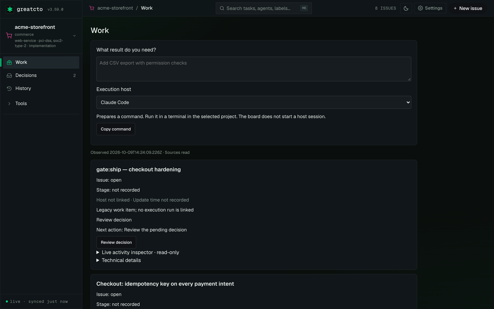

<div align="center">


**Выпускайте продукты с тем кодинг-агентом, который у вас уже есть.**

[](https://www.npmjs.com/package/great-cto)
[](https://www.npmjs.com/package/great-cto)
[](../../LICENSE)
[](https://claude.com/claude-code) [](https://github.com/openai/codex)

<a href="https://greatcto.systems/proof"></a>

```bash
npx great-cto init
```

[Сайт](https://greatcto.systems) · [Один реальный прогон →](https://greatcto.systems/proof) · [Блог](https://greatcto.systems/blog/) · [Changelog](../../CHANGELOG.md)

[English](../../README.md) · [简体中文](../zh-CN/README.md) · [繁體中文](../zh-TW/README.md) · [日本語](../ja/README.md) · [한국어](../ko/README.md) · [Español](../es/README.md) · [Português](../pt-BR/README.md) · [Deutsch](../de/README.md) · [Français](../fr/README.md)

</div>

> Перевод английского [README](../../README.md) версии **v3.47.0** (2026-10-02).
> При расхождении канонична английская версия.

---

**Ваш кодинг-агент пишет код. Это — то, что его проверяет.**

Опишите продукт или фичу. **71 агент** с узкими задачами проводит её через бриф,
архитектуру, сборку, ревью и безопасность; вторая модель из другого семейства
читает тот же дифф. Три решения остаются за вами — что строим, как и выпускаем ли, —
а на выходе **ваш репозиторий** и **работающий URL**. Платите вы своему
LLM-провайдеру; great_cto под MIT и ничего не берёт.

## Быстрый старт

```bash
npx great-cto init
```

Перезапустите Claude Code. Каждый день нужны три вещи:

| | В Claude Code | В терминале |
|---|---|---|
| **Начать работу** | `/start "add Google login"` | `great-cto run "add Google login"` |
| **Что ждёт меня** | `/inbox` | `great-cto status` |
| **Продолжить** | `/resume` | `great-cto resume` |

`/start` принимает новый продукт или задачу в существующем проекте и сам выбирает
процесс. `/resume` продолжает только то, что вы уже одобрили; ожидающее решение
всё равно ждёт вас. Остальное — `/review`, `/spec`, `/save`, `/digest` и прочее —
под рукой, когда понадобится: [все команды](../COMMANDS.md).

<p align="center">
  
</p>

Панель на `localhost:3141` открывается на **Work** — ваши задачи, решения, которые
ждут вас, и то, что уже выпущено. Расходы, агенты и ревьюеры — в **Tools**.
Отсутствие на ней никогда не выглядит как успех: проверка, которая не смогла
решить, показывает `unverifiable`, неизмеренная стоимость — `unmeasured`,
ревьюер, который не смог запуститься, — `unavailable`.

## На OpenAI Codex

`npx great-cto init --host codex` даёт Codex скиллы, MCP-сервер и шесть защитных
хуков (одобрите их один раз: запустите `codex` в терминале и выберите
**Trust all and continue**). У Codex нет нативной поверхности плагинов для
слэш-команд и ролевых агентов, поэтому пайплайн запускается через CLI:

```bash
great-cto run "add Google login" --host codex --allow src,tests,docs
great-cto status --host codex
great-cto resume --host codex
```

Codex сам плагин не обновляет — это делает `great-cto upgrade`. Подробности,
смешанные прогоны Claude + Codex и Codex как второй ревьюер:
[руководство по Codex host](../HOST-CODEX.md).

## Когда он вас останавливает

Одна строка в `.great_cto/PROJECT.md`:

| `approval-level` | Останавливает на | Остановок |
|---|---|---|
| **`ship-only`** | **деплое — и даёт вам бриф о том, что строится** | **1** |
| `product-only` | что строим · выпускаем ли | 2 |
| `gates-only` *(по умолчанию)* | что строим · дизайн · деплой | 3 |
| `strict` | дизайн · код-ревью · деплой | 3 |
| `auto` | ничего в пайплайне | 0 |

Регулируемые продукты — финтех, медицина, госсектор — сохраняют гейты
безопасности, комплаенса и выпуска на любом уровне. [Как устроены гейты](../GATES.md).

## Цифры, измеренные

| | |
|---|---|
| Одна фича целиком, с полной трассировкой | **1h 26m · $3.40** — [квитанции](https://greatcto.systems/proof) |
| Целый продукт — 7 собраны в открытом бенчмарке | **$171** · **70/100**, **2026-07-10** — [воспроизвести](../benchmarks/BENCH-2026-07-batch1.md) |
| Типичный месяц, 20 прогонов | **~$34** — вы платите своему LLM-провайдеру, больше ничего |

## Ограничения

Для одного разработчика, не для команды; не хостинг-конструктор — нужен ваш
кодинг-агент; не CI/CD; заготовки комплаенса — отправная точка, а не сертификация;
вывод LLM недетерминирован. Честная версия каждого пункта и то, что инструмент
отказывается утверждать: [docs/DETAILS.md](../DETAILS.md).

## Подробнее

[Документация](../README.md) · [Начало работы](../tutorials/getting-started.md) ·
[Команды](../COMMANDS.md) · [Гейты](../GATES.md) · [Агенты](../reference/agents.md) ·
[FAQ](../FAQ.md) · [Всё остальное](../DETAILS.md) ·
[Issues](https://github.com/avelikiy/great_cto/issues) · [Безопасность](../../SECURITY.md) ·
[Участие](../../CONTRIBUTING.md) · [Приватность — телеметрия выключена по умолчанию](../PRIVACY.md)

MIT — [LICENSE](../../LICENSE). Автор — [@avelikiy](https://github.com/avelikiy).
Если инструмент сэкономил вам время, звезда поможет другим соло-разработчикам его найти.
